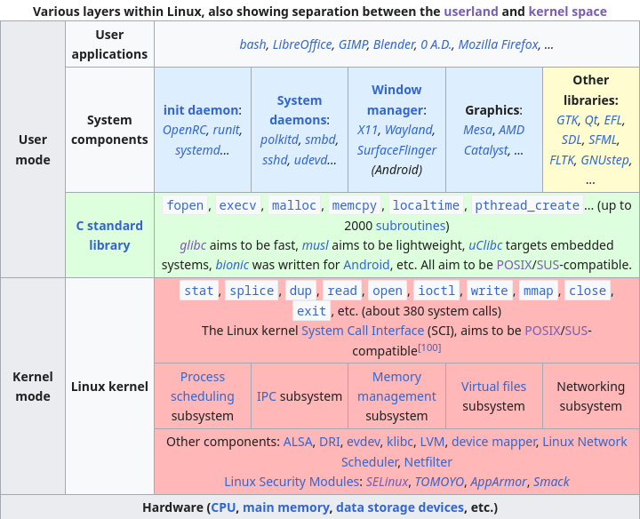
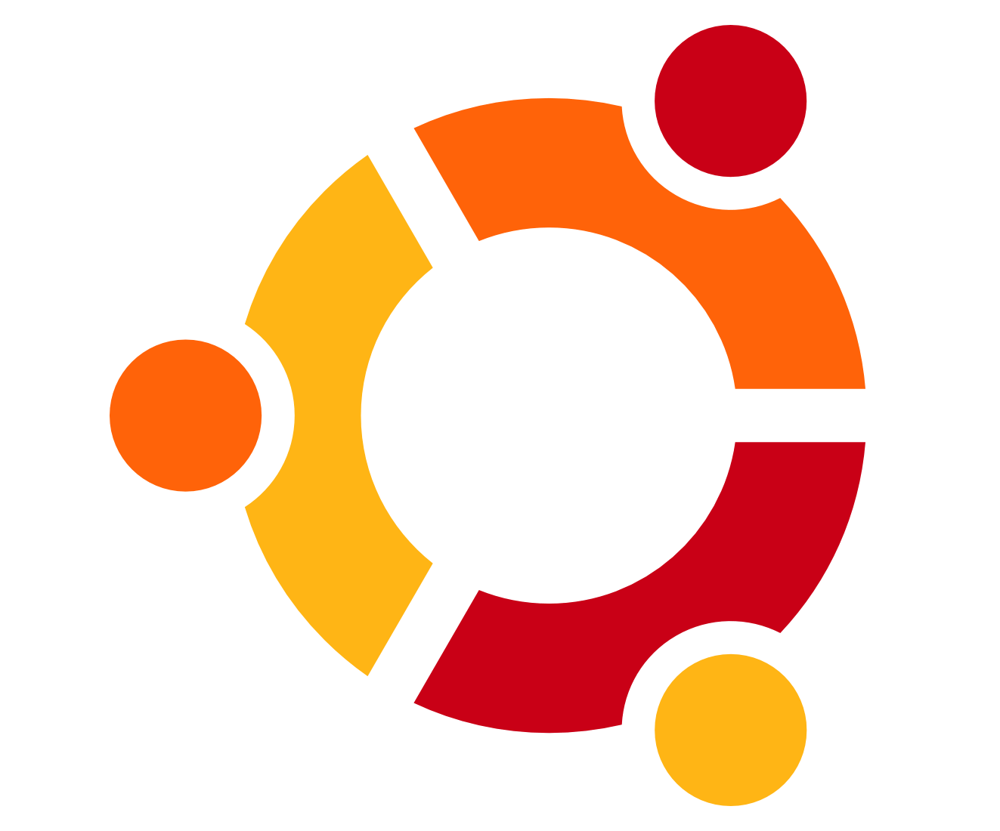
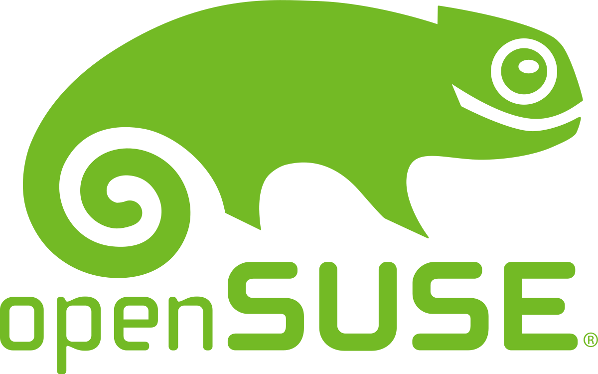

# <!--fit--> linux rabit hole
## curso completo de linux y los temas que lo rodean
### por Ariel Parra

---

# **1. ¿Qué es linux?**

---

# 1.1 Definición
Es un kernel monolitico de codigo abierto con licencia GNU GPL v2. 

---

- que es un kernel monolitico? El kernel es un software que tiene el control del hardware, administra y optimiza los recursos del sistema como alocacion de memoria ram, procesos del CPU, drivers, etc. Actuando asi como un puente entre aplicaciones y el hardware. Este es monolitico cuando todos los servicios del sistema operan en el kernel atravez de system calls   
- que es el codgo abierto? Es software donde cualquier persona puede ver,analizar y por ende modificar el codigo fuente
- cual es la licencia GPLv2?  Es una licencia de software donde cualquier modificacion al codigo debe tener la misma licencia y tambien que por cada archivo binario que sea distribuido tiene que estar disponible su codigo fuente.

---

# 1.2 Historia 

Fue creado en 1991 por el estudiante de la universidad de Helsinki Linus Torvalds, al mismo tiempo Richard Stallman junto con su proyecto GNU de la fundacion de software libre (FSF) ya habian creado las aplicaciones y utilidades de un sistema operativo. Estas aplicaciones y utilidades fueron agregadas al Linux kernel para crear un systema completo llamado GNU/Linux

---

# 1.3 Filosofia de linux

la filosofia de linux se basa principalmente en la filosofia de UNIX y del opensource, donde linux se diferencia es al darle control completo al usuario, dandole la libertad de elegir, estudiar, modificar y distribuir cualquier parte de su sistema operativo.
El kernel de linux en si no tiene blobs binarios sino que estos son distribuidos en el linux-firmware, esto sirve para inicializar el hardware y los drivers.
Linux tiene estandares como el LSB (Linux Standard Base) que define system interfaces, librarias, and runtimes de donde las librerias y aplicaciones dependen
se suele usar el Filesystem Hierarchy Standard de linux

---

# 1.4 Linux Filesystem Hierarchy Standard

---

# 1.5 las capas de linux

Imagen recuperada de [wikipedia](https://en.wikipedia.org/wiki/Template%3ALinux_layers)

---

# **2. temas relacionadas**

---

# 2.1 UNIX
UNIX es un sistema operativo creado a principios de los 70s en AT&T por Dennis Ritchie (creador del lenguaje C) y Ken Thompson (creador de B predecesor del lenguaje C) 
- POSIX: "Portable Operating System Interface", son una serie de standares de uso impuestos por el IEEE (Institute of Electrical and Electronics Engineers) que incluye el I/O, la terminal, comandos y redes.
- Single UNIX Specification: es un estandard para sistemas operativos para usar el tredemark de UNIX, con interfaces para el lenguaje C, el shell y comandos.
- UNIX filosofy (Doug McIlroy):
Escribe programas que hagan una cosa muy bien, que trabajen juntos (input de uno es el output de otro) y *que manejen streams (serie de bytes para I/O), porque son  una interfaz universal.
- todo son archivos, los dispositivos, teclados, discos duros, etc. estos son manejados con streams y almacenados en la carpeta /dev 

---

# 2.2 FOSS

Free and open source software, es software que tiene codigo abierto, donde uno es libre de estudiar, modificar, aunque la distribucion depende de las licencias. 

# 2.2.1 licencias open source más comunes
- [creative commons:](https://creativecommons.org/licenses/) uso libre pero con atribucion obligatoria, comunmente usados para imagenes, videos y articulos. , , , ,  y 
- [AGPL:](https://www.gnu.org/licenses/agpl-3.0.en.html) similar al GPL pero para servicios en linea
- [Apache](https://www.apache.org/licenses/LICENSE-2.0): incluir la nota de copyright  
- BSD [2](https://opensource.org/license/bsd-2-clause/)/[3](https://opensource.org/license/bsd-3-clause/): incluir la nota de copyright 
- GPL [v2](https://www.gnu.org/licenses/old-licenses/gpl-2.0.html)/[v3](https://www.gnu.org/licenses/gpl-3.0.html): codigo fuente disponible y trabajos deribados con la misma licencia 
- [MIT](https://opensource.org/license/mit/): incluya la nota de copyright  

---

- Free/libre: la filosofia free tiene relacion con richard stallman y su proyecto GNU, esta se basa en software que respeta la libertad del usuario, libertad de distrubucion, libertad de uso, libertad de estudio, etc. llendo en contra del software privado de codigo cerrado, los binary blobs, las licencias y EULAs no permisivas, los  y el DRM.

---

# 2.3 BSD

"Berkeley Software Distribution" es un sistema operativo creado en la universidad de Berkeley en California, de codigo abierto y originalmente extension de AT&T’s Research UNIX, a diferencia de linux este tiene la BSD C library, aunque pueden compartir ciertas utilidades de GNU

los dos forks más importantes son:
- freeBSD: es un proyecto ["grande"](https://svnweb.freebsd.org/base/stable/12/) con muchos sistemas operativos forkeados apartir de el, como FreeNAS, pfsense, etc.
- OpenBSD: es un proyecto relativamente mas ["chico"](https://cvsweb.openbsd.org/src/) que freebsd, es [inovador](https://www.openbsd.org/innovations.html
) y crean nuevas herramientas usadas en toda la comunidad unix, mientras que es de los sistemas más seguros

estos pueden tener ciertas [ventajas y desventajas](https://serverfault.com/questions/5267/what-is-good-about-the-bsds/5352#5352) a linux

---

# 2.4 Privacidad 

te recominedo esta [guia](https://www.privacyguides.org/en/) de privacidad o tambien a la youtuber [Naomi Brockwell](https://yewtu.be/channel/UCSuHzQ3GrHSzoBbwrIq3LLA)
- [duckduckgo](https://seonorth.ca/news/why-duckduckgo-is-bad/) no es bueno
- [proton](https://techcrunch.com/2021/09/06/protonmail-logged-ip-address-of-french-activist-after-order-by-swiss-authorities/) no es confiable
- las VPN no te dan [privacidad](https://gist.github.com/joepie91/5a9909939e6ce7d09e29)
- la gente esta [desinformada](https://www.whonix.org/wiki/Tor_Myths_and_Misconceptions) acerca de tor

# 2.5 Seguridad

te recomiendo esta [guia](https://wiki.archlinux.org/title/security) de seguridad de la arch wiki
- usa [linux-hardened](https://github.com/anthraxx/linux-hardened) kernel
- [selinux](https://selinuxproject.org/page/Main_Page) o [AppArmor](https://apparmor.net/) para el control de acceso
- no uses [kali linux](https://www.kali.org/docs/introduction/should-i-use-kali-linux/)
- usa OpenBSD, ya que es el sistema unix más [seguro](https://www.openbsd.org/security.html)

---

# 2.6 Minimalismo
el minimalismo en cuestion de linux, se trata de usar y escribir programas simples siguiendo principios de UNIX y KISS,  dos ideas deribadas del minimalismo son:
- gnuless: algunos programas de GNU pueden no ser los más eficientes o minimalistas, un video acerca del tema: [Luke Smith: GNU is bloated!](https://yewtu.be/watch?v=nTCHapo8QFM), donde se habla tambien de la pagina [harmfull cat -v](https://harmful.cat-v.org/software/) la cual tiene ideas extremas al respecto.
- [init freedom](https://www.devuan.org/os/init-freedom): systemd es el init system más usado, pero este no sigue la filosofia de unix ya que systemd no solo es el init, ya que tiene muchas otras [funciones](https://systemd-free.artixlinux.org/why.php) y herramientas, por lo que usar [alternativas](https://without-systemd.org/wiki/index_php/Main_Page/#other_UNIX-like) es [recomendado](https://nosystemd.org/)

Paginas que recomiendan software minimalista: [lukesmith](https://lukesmith.xyz/programs/) y [suckless.org](https://suckless.org/rocks/)

---

# 2.7 Ricing (customizacion)

Como linux te permite modificar el sistema, puedes configurarlo a todos tus gustos artisticos, se suelen usar paletas de colores como [nord](https://www.nordtheme.com/) o [Catppuccin](https://github.com/catppuccin/palette).
Uno de los mejores lugares para ver, aprender y compartir rices es  [r/unixporn](https://reddit.com/r/unixporn/), donde los usuarios comparten [dotfiles](https://wiki.archlinux.org/title/Dotfiles) que son los archivos que van en la carpeta de usuario y tienen las configuraciones de los programas que se van a costumizar, usualmente son respaldados en un servidor de git.
Tambien puedes usar una distrubucion que ya venga riceada como [archcraft](https://archcraft.io/gallery.html) o puedes usar scripts de la comunidad como [LARBS.](https://larbs.xyz/)

---

# **3. Comparación de Sistemas operativos**

---

# 3.1 Ventajas de linux 
- es gratuito y opensource
- superioridad en cuestion de audio con [pipewire](https://pipewire.org/)
- puede arrancar [rapidamente](https://www.forbes.com/sites/jasonevangelho/2019/06/19/infographics-linux-mint-challenges-windows-10-in-small-business-speed-tests-laptop/#7a560d2369bb) el sistema y las aplicaciones
- tiempos menores de [compilacion](https://medium.com/aedm/windows-wsl-and-linux-a-build-time-benchmark-for-java-rust-go-and-node-43188a9c77d6)
- mejores resultados en [geekbench](https://yewtu.be/watch?v=7BreeFlhP78)
- usa menos memoria [RAM](https://yewtu.be/watch?v=L3d9okxKcjM)
- es [portable](https://www.oreilly.com/library/view/linux-kernel-development/0672327201/ch19.html)
- tiene multiples [comunidades](https://www.makeuseof.com/tag/4-helpful-communities-new-linux-users/) para soporte
- altamente [customizable](https://www.reddit.com/r/unixporn/)
- tiene drivers opensource oficiales de [AMD](https://gpuopen.com/amd-open-source-driver-for-vulkan/) y no oficiales de [nVidia](https://nouveau.freedesktop.org/)
- puedes [revivir](https://itsfoss.com/mystory-linux-13-years-laptop/) laptops antiguas
- promueve [open source](https://www.linuxfoundation.org/resources/open-source-guides/participating-in-open-source-communities)

----

# 3.2 Más referencias de las ventajas de linux 
- [linfo: 25 Reasons to Convert to Linux](http://www.linfo.org/reasons_to_convert.html)
- [Joe Collins: Linux vs. Windows | The Fundamental Differences](https://yewtu.be/watch?v=p4xA7GRmf6o)
- [Dave's Garage: Linux vs Windows Round 1: Open Source vs Proprietary - From a Retired Microsoft Dev](https://yewtu.be/watch?v=a9ZADRy5W0c)
- [DistroTube: How Linux Respects Your Privacy (And How Windows Does NOT!)](https://yewtu.be/watch?v=KarYADRAoTU)
- [Average Linux User: Linux advantages](https://yewtu.be/watch?v=mJEWPqHXNzs)
- [The Linux Foundation: Why are Linux Jobs so In Demand?](https://training.linuxfoundation.org/blog/why-are-linux-jobs-so-in-demand/)
- [The Linux Experiment: Windows, macOS & Linux PRIVACY compared: why do they need ALL THIS DATA?!](https://yewtu.be/watch?v=MMc5zgALLiY)
- [ForrestKnight:  Why I Code on Linux Instead of Windows](https://yewtu.be/watch?v=HrYtwz0Xe2Q)

---
# 3.3 Desventajas de linux

- tienes que aprender temas nuevos, aprender a buscar soluciones y leer.
- no puedes correr ciertos juegos: [rainbow six](https://www.protondb.com/app/359550), [roblox](https://news.itsfoss.com/roblox-linux-end/), [etc.](https://www.protondb.com/explore?sort=fixWanted)
- no puedes correr ciertas aplicaciones: [Adobe Photoshop](https://appdb.winehq.org/objectManager.php?sClass=application&iId=17), [MS Office](https://appdb.winehq.org/objectManager.php?sClass=application&iId=31), [etc](https://appdb.winehq.org/).
- sin soporte completo para [HDR](https://wiki.archlinux.org/title/HDR_monitor_support) 
- problemas con [variable refresh rate](https://wiki.archlinux.org/title/Variable_refresh_rate)
- problemas con [fractional scaling](https://wiki.archlinux.org/title/HiDPI)
- problemas con [impresoras](https://opensource.com/article/21/8/add-printer-linux)
- screen tearing en [X11 (xorg)](https://christitus.com/fix-screen-tearing-linux/) 
- problemas al compartir pantalla con audio en [discord](https://wiki.archlinux.org/title/Discord#Screen_sharing_with_audio) y [MS Teams](https://answers.microsoft.com/en-us/msteams/forum/all/sharing-system-sound-in-teams-for-linux/f1c70d83-e9bd-41b4-abde-d78fae764d5c)
- el driver para nvidia nouveau tiene un [peor rendimiento](https://openbenchmarking.org/result/2106300-IB-NOUVEAU2060) que el oficial
- la capa de compatibilidad con windows wine puede correr [malware](https://wiki.winehq.org/FAQ#Is_Wine_malware-compatible.3F)

---

# 3.4 Ventajas MacOS

- tiene interfaces con diseños [inovadores](https://design.tutsplus.com/tutorials/how-apple-ended-up-leading-the-icon-design-trends-and-whether-or-not-you-should-fight-it--cms-32201)
- tiene una certificacion [posix](https://www.opengroup.org/openbrand/register/apple.htm)
- usar [xcode](https://developer.apple.com/xcode/) para desarrollar aplicaciones de iOS/MacOS
- juegos nativos como [roblox](https://www.roblox.com/download) o juegos de Blizzard como [WOW](https://www.blizzard.com/en-sg/download?platform=macos)
- aplicaciones nativas como [Adobe Photoshop](https://helpx.adobe.com/support/photoshop.html), [MS Office](https://www.microsoft.com/en-us/microsoft-365/mac/microsoft-365-for-mac), [FL Studio](https://www.image-line.com/), etc.
- compatibilidad y uso de [heic/hecv](https://support.apple.com/en-us/HT207022) integrado al sistema
- tienen el [ecosistema de apple](https://www.apple.com/macos/continuity/)
- tienen de los mejores [procesadores arm](https://www.techspot.com/review/2499-apple-m2/) para escritorio
- soporte de [HDR](https://support.apple.com/en-us/HT210980)
- puedes compartir pantalla con sonido en [discord](https://support.discord.com/hc/en-us/articles/1500006741102-macOS-Screen-Share-with-Audio-Update-FAQ) y [MS Teams](https://answers.microsoft.com/en-us/msteams/forum/all/sharing-system-sound-in-teams-for-linux/f1c70d83-e9bd-41b4-abde-d78fae764d5c)
- buen rendimiento en juegos con [D3DMetal](https://developer.apple.com/metal/) y  [game porting toolkit](https://old.reddit.com/r/macgaming/comments/1446hj6/all_working_games_list_game_porting_toolkit/)

---

# 3.5 Desventajas MacOS

- Appple ID es un requisito para instalar MacOS
- no puede correr ciertos [juegos](https://www.protondb.com/explore?sort=fixWanted)
- quitaron el soporte de [32-bits](https://support.apple.com/en-us/HT208436) y con eso muchas  [apps](https://gist.github.com/stevemoser/a4388df17633beae5bc3fb07d38373e2)
- hardware [oficial](https://everymac.com/systems/apple/index-apple-specs-applespec.html) y [no oficial](https://hackintosh.com/#hackintosh_compatible) limitados
- las computadoras Mac son [costosas](https://everymac.com/global-mac-prices/mac-prices-mexico-mx.html)
- la existencia de [OCSP](https://blog.jacopo.io/en/post/apple-ocsp/)
- multiples problemas de [privacidad](https://sneak.berlin/20201112/your-computer-isnt-yours/)
- los [contratos de licencia de software](https://www.apple.com/legal/sla/)
- posibles conexiones con NSA e implicacion con [PRISM](https://www.washingtonpost.com/investigations/us-intelligence-mining-data-from-nine-us-internet-companies-in-broad-secret-program/013/06/06/3a0c0da8-cebf-11e2-8845-d970ccb04497_story.html)
- no suele haber drivers opensource
- la capa de compatibilidad con windows wine puede correr [malware](https://wiki.winehq.org/FAQ#Is_Wine_malware-compatible.3F)
- no tiene controles de volumen por [aplicacion](https://apple.stackexchange.com/questions/381397/is-it-possible-to-set-an-individual-sound-volume-for-each-program-on-a-mac)

---

# 3.6 Recomendaciones al usar MacOS
- no uses una cuenta de Apple ID con tus datos personales
- usa macOS en una vm con NAT activado
- lee esta [guia](https://github.com/drduh/macOS-Security-and-Privacy-Guide) de privacidad en MacOS
- usa [alacritty](https://alacritty.org/) como emualdor terminal
- usa [brew](https://brew.sh/) como package manager

---

# 3.7 Ventajas de Windows
- compatibilidad perfecta con [directX](https://www.microsoft.com/en-us/download/details.aspx?id=35)
- [compatibilidad](https://support.microsoft.com/en-us/windows/make-older-apps-or-programs-compatible-with-windows-783d6dd7-b439-bdb0-0490-54eea0f45938) con aplicaciones antiguas de windows
- las empresas les importa la distribucion del [mercado](https://gs.statcounter.com/os-market-share/desktop/worldwide/#monthly-202306-202306-bar) de sistmas operativos, por lo que ciertas aplicaciones y juegos estan pensados para windows 
- soporte de [HDR](https://support.microsoft.com/en-us/windows/hdr-settings-in-windows-2d767185-38ec-7fdc-6f97-bbc6c5ef24e6)
- Windows Subsystem for Linux [(WSL)](https://learn.microsoft.com/en-us/windows/wsl/about)  y Windows Subsystem for Android [(WSA)](https://learn.microsoft.com/en-us/windows/android/wsa/)

---

# 3.8 Desventajas de Windows

---

## 3.8.1 Desarrollador
- [java updater](https://www.java.com/en/download/help/java_update.html) esta siempre activo en segundo plano
- ejecuta programas de manera lenta (a tirones) aunque sea pwsh
- Hyper-V y Windows hypervisor platform solo disponibles para [Windows Pro](https://www.microsoft.com/en-us/windows/compare-windows-10-home-vs-pro)
- Virtual Machine Platform, Hyper-V, Windows hypervisor platform y WSL2 interfieren con aplicaciones: [dell alienware control](https://www.dell.com/community/Alienware-Desktops/AWCC-OC-Controls-incompatible-with-Virtual-Machine-Platform/m-p/8239494#M60811), [throttle stop](https://www.techpowerup.com/forums/threads/throttlestop-dead-on-windows-11.284102/), etc.
- los hosts en windows son [read-only](https://superuser.com/questions/958991/windows-10-cant-edit-hosts-file) y modificarlo puede alertar al [antivirus](https://support.microsoft.com/en-au/topic/hosts-file-is-detected-as-malware-in-windows-defender-4320fa8b-0d54-1129-db85-61f095144521)
- para correr un ["hello world!"](https://stackoverflow.com/questions/55603111/unable-to-compile-rust-hello-world-on-windows-linker-link-exe-not-found) de rust ocupas que descargar visual studio community junto con 1gb para los c++ build tools y el Windows SDK 
- visual studio community usa como [10gb](https://developercommunity.visualstudio.com/t/visual-studio-uses-too-disk-much-space/145475) o [más](https://developercommunity.visualstudio.com/t/hard-disk-space-loss/585904)
- problemas con librerias, aveces tienes que compilarlas manualmente como [pycripto](https://old.reddit.com/r/webdev/comments/132eql/owhy_many_people_dislike_windows_as_an_development/) o en mi caso librespot de rust 
- Problemas de velocidad con [I/O y ntfs](https://github.com/Microsoft/WSL/issues/873)

---

## 3.8.2 Uso general
- las apps por defecto se actualizan individualmente ya sea abriendo la aplicación o teniendo que descargar la nueva version de la pagina del creador
- para usar winget ocupas una cuenta microsoft para descargar [App-Installer](https://apps.microsoft.com/store/detail/appinstaller/9NBLGGH4NNS1?hl=de-at&gl=at&rtc=1) de la microsoft store y para usarlo ocupas constantemente aceptar los [UAC](https://learn.microsoft.com/en-us/windows/package-manager/winget/) prompts, aparte de acepatar la [CLA](https://opensource.microsoft.com/cla/) 
- no puedes nombrar archivos con ciertos [nombres](https://yewtu.be/watch?v=bC6tngl0PTI)
- windows pro cuesta [$6399](https://www.microsoft.com/es-mx/d/windows-11-pro/dg7gmgf0d8h4) pesos MXN
- windows 11 [requiere](https://learn.microsoft.com/en-us/windows/whats-new/windows-11-requirements) a tener una cuenta microsoft y usarla en tu sistema
- el sistema operativo se expande hasta más de [40gb](https://superuser.com/questions/1467359/windows-takes-up-40gb-of-disk-space)
- el buscador de windows es [ineficiente](https://computerinfobits.com/why-is-windows-10-search-so-bad/)
- prefetch y superfetch (SysMain), suelen tener el disco duro al [100%](https://yewtu.be/watch?v=MmH4tjH2yMc) de uso 

---

- suele haber más [virus](https://www.howtogeek.com/141944/htg-explains-why-windows-has-the-most-viruses/) que macOS o linux 
- aplicaciones freeware pueden tener virus como [atubecatcher](https://old.reddit.com/r/antivirus/comments/snqipr/is_atube_catcher_a_virus/), etc.
- la microsoft store tiene aplicaciones más aplicacioens [.appx](https://learn.microsoft.com/en-us/uwp/schemas/appxpackage/uapmanifestschema/schema-root
) que .exe
- tienes que pagar para poder usar archivos [HEVC](https://apps.microsoft.com/store/detail/hevc-video-extensions/9NMZLZ57R3T7?hl=en-us&gl=us&activetab=pivot%3Aoverviewtab)
- windows incluye [bloatware](https://www.digitalcitizen.life/windows-10-bloatware/)
- los antivirus pueden bloquear aplicaciones/servicios en el [firewall](https://www.mcafee.com/support/?locale=en-US&articleId=TS102946&page=shell&shell=article-view) 
- Windows Antimalware Service puede usar [100%](https://answers.microsoft.com/en-us/windows/forum/all/high-cpu-usage-by-antimalware-service-executable/4f6f635a-b3ad-444c-8cd0-68fb1e9f4bfa) del cpu
- Problemas en pantallas con [high dpi](https://support.microsoft.com/en-gb/topic/windows-scaling-issues-for-high-dpi-devices-508483cd-7c59-0d08-12b0-960b99aa347d) dando lugar a [apps borrosas](https://support.microsoft.com/en-us/windows/fix-apps-that-appear-blurry-in-windows-10-e9fe34ab-e7e7-bc6f-6695-cb169b51de0f)
- la solucion a la mayoria de errores es [reistalar](https://answers.microsoft.com/en-us/windows/forum/all/windows-update-system-restore-and-repair-failed/aaf28405-55c0-4ee2-b4b4-f13571680b32) el sistema operativo
- las [apps](https://www.pcmag.com/how-to/stop-windows-10-apps-from-launching-at-startup) se ejecutan al inicio o crean servicios que se ejecutan al inicio
- fondos de pantalla en slidehow puede no [funcionar](https://answers.microsoft.com/en-us/windows/forum/all/background-slideshow-stops-working/acfcabe4-56fb-436a-afc6-42bdd877ca29)
- pocas opciones open source de [customizacion](https://github.com/Awesome-Windows/Awesome#customization) y algunas opciones privadas cuestan [wallpaperengine](https://store.steampowered.com/app/431960/Wallpaper_Engine/), [taskbarX](https://apps.microsoft.com/store/detail/taskbarx/9PCMZ6BXK8GH?hl=en-us&gl=us), [start11](https://www.stardock.com/products/start11/), etc.

---

## 3.8.3 hardware
- Device encryption ocupa hardware [moderno](https://www.microsoft.com/en-us/windows/compare-windows-10-home-vs-pro) ([InstantGo](https://blogs.windows.com/windowsexperience/2014/06/19/instantgo-a-better-way-to-sleep/#RXGeiruxOD7f3V0q.97)/[AOAC](https://www.microsoft.com/en-us/store/b/alwaysconnectedfaq)/[HSTI-compliant](https://learn.microsoft.com/en-us/windows-hardware/test/hlk/testref/hardware-security-testability-specification)), basicamente de 2014 en adelante.
- los [requisitos](https://www.microsoft.com/en-us/windows/windows-11-specifications) de Windows 11, procesador de 64 bits, UEFI, TPM v2.0 y una grafica compatible con DirectX12.
- los discos duros con ntfs tienen que [defragmentarse](https://learn.microsoft.com/en-us/previous-versions/cc767961(v=technet.10))
- los drivers oficiales de nvidia tienen [telemetria](https://www.geeks3d.com/20161107/nvidia-telemetry-in-geforce-drivers/)
- no suele haber drivers opensource

## 3.8.4 juegos
- descargas [muchas versiones](https://www.howtogeek.com/256245/why-are-there-so-many-microsoft-visual-c-redistributables-installed-on-my-pc/) de microsoft visual c++ redistributable por juego
- los juegos de la microsoft store (xbox app) suelen correr [peor](https://old.reddit.com/r/techsupport/comments/v4nhaf/so_ive_been_wondering_if_its_just_me_or_windows/) o dar [input lag](https://www.reddit.com/r/roblox/comments/oahvsf/roblox_player_vs_microsoft_store_app_input_lag/)
- no puedes acceder a las [carpetas](https://www.makeuseof.com/windows-access-windowsapps-folder/) de juegos de la microsoft store (xbox app) aun siendo administrador

---

## 3.8.5 privacidad
- opciones anti privacidad activados por [defecto](https://learn.microsoft.com/es-es/intune-education/media/rs5_choose_settings.png)
- windows [phone home](https://yewtu.be/watch?v=IT4vDfA_4NI).
- windows esta implicacdo con la [NSA](http://techrights.org/wiki/index.php/Microsoft_and_the_NSA) y [PRISM](https://en.wikipedia.org/wiki/PRISM)
- datos de diagnosticos [obligatorios](https://learn.microsoft.com/en-us/windows/privacy/required-windows-diagnostic-data-events-and-fields-2004)
- [edge](https://learn.microsoft.com/en-us/microsoft-edge/privacy-whitepaper/) y [office](https://learn.microsoft.com/en-us/deployoffice/compat/data-that-the-telemetry-agent-collects-in-office) envian telemetria
- [Delivery Optimization](https://learn.microsoft.com/en-us/windows/deployment/do/waas-delivery-optimization) esta activado por [defecto](https://www.dell.com/support/kbdoc/es-mx/000125580/information-on-the-windows-update-delivery-optimization-feature-within-windows-10?lang=en)

---

# 3.9 más referencias de las desventajas de windows
- [GNU: Microsoft's Software is Malware](https://www.gnu.org/proprietary/malware-microsoft.en.html)
- [Jody Bruchon Tech: Windows 11 Must Be Stopped - A Veteran PC Repair Shop Owner's Dire Warning](https://yewtu.be/watch?v=LcafzHL8iBQ)
- [reddit: why many people dislike windows as an development environment?](https://old.reddit.com/r/webdev/comments/132eql/why_many_people_dislike_windows_as_an_development/)
- [reddit: what is your worst experience with ms windows?](https://old.reddit.com/r/linuxmasterrace/comments/u19uee/what_is_your_worst_experience_with_ms_windows/)
- [reddit: why so much hate to windows?](https://old.reddit.com/r/linuxmasterrace/comments/qi370x/why_so_much_hate_to_windows/)
- [Wikipedia: Criticism of Microsoft](https://en.wikipedia.org/wiki/Criticism_of_Microsoft)
- [installgentoo wiki: Windows](https://wiki.installgentoo.com/wiki/Windows)
- [installgentoo wiki: Windows 10](https://wiki.installgentoo.com/wiki/Windows_10)
- [itvision blog: why windows 10 sucks](https://itvision.altervista.org/why-windows-10-sucks.html)
- [itvision blog: why windows 11 sucks](https://itvision.altervista.org/why-windows-11-sucks.html)

---

# 3.10 Recomendaciones al usar windows
- usa windows 10 sin iniciar sesion en una cuenta de microsoft
- descarga apps de la ms store con https://store.rg-adguard.net/
- usa [PowerToys](https://github.com/microsoft/PowerToys) para mejorar la experiencia de uso
- si usas windows en una vm con NAT usa [WinApps](https://github.com/Fmstrat/winapps)
- si usas una grafica nvidia, instala drivers sin telemetria con [nvcleanstall](https://www.techpowerup.com/download/techpowerup-nvcleanstall/) 
- si es para jugar, preinstala todos los Visual C++ desde [techpowerup](https://www.techpowerup.com/download/visual-c-redistributable-runtime-package-all-in-one/)
- usa [Chris Titus Tech's Windows Utility](https://github.com/ChrisTitusTech/winutil) para desactivar facilemente telemetria o tambien para activar UTC si se usa windows en dual-boot
- bloquea las direcciones a donde se envian telemetrias en el archivo de [hosts](https://gist.github.com/VirtuBox/f09968a2d27bc00ba58b3617c61dc54e)
- prueba que el software descargado de internet no tenga virus con [virustotal](https://www.virustotal.com/gui/)
-  usa aplicaciones con posibles virus en [sandboxie plus](https://sandboxie-plus.com/)
- [autoruns](https://learn.microsoft.com/en-us/sysinternals/downloads/autoruns) para desactivar apps/servicios al inicio del sistema 
- usa [alacritty](https://alacritty.org/) como emualdor terminal y usa [scoop](https://scoop.sh/) como package manager

---

# **4. Distribuciones de linux**

---

# 4.1 ¿Qué es una distribucion de linux?
una distribucion (distro) de linux es un sistema operativo completo con muchos componentes opensource, utilidades e interfaces.

---
# 4.2 ¿Qué compone una distrubucion de linux?
los componentes y caracteristicas que construyen a una distribucion de linux son: 
- filosofia: KISS/minimalismo, free/libre, bsd userspace, compilación, etc.
- uso: juegos, media, privacidad, seguridad, escolar, etc.
- Release model: fix, rolling release, lts, bleeding edge
- Boot Loader: GRUB, Syslinux, LILO, systemd-boot, etc.
- tipo de kernel: Stable (vanilla), zen, libre, LTS, Realtime, etc.
- init system / daemon manager: runit, OpenRC, systemd, SysVinit, s6, dinit, etc.
- systema de archivos (File system): ext2/3/4, Btrfs, XFS, ZFS, etc. 
- jerarquia de archivos: Linux File Hierarchy Structure o modificacion de este. 
- libreria de c: glibc, musl, uClibc, etc.
- utilidades basicas: gnu core utils, busybox, util-linux, bin-utils,  lspci-utils, etc.

---

- interfaz de shell: bash, zsh, fish, dash, ash, etc.
- servidor grafico: Xorg (X11) / protocolo grafico: Wayland 
- tecnologia de audio: ALSA, pulseaudio, Jackaudio, pipewire.
- login/display manager: ssdm (KDE), GDM (GNOME), LightDM, etc.
- window manager: dwm, sway, i3, xmonad, etc.    
- Desktop environment: Gnome, Plasma, xfce4, etc. 
- Graphics Toolkits: GTK+ , Qt, etc.
- gestor de paquetes (package manager): apt, DNF, pacman, portage, yay, etc.
- formato de paquetes: .deb, .rpm, .pkg.tar.zst, source code, install scripts, etc.

---

- repositorio de paquetes de la distribucion
- aplicaciones incluidas: 
    - terminal (CLI/TUI):
        - editor de textos: nano, vim, neovim, emacs, etc.
        - informacion: neofetch, htop, etc.
        - etc.
    - graficas (GUI):
        - navegador: firefox, chromium, etc.
        - Office Suite: libreoffice, onlyoffice, Calligra etc.
        - emulador de terminal: konsole, gnome-terminal, alacritty, kitty, st, etc. 
        - editor de textos: kate, Gnome text editor, gvim, etc.
        - explorador de archivos: nautilus (gnome), dolphin (KDE)
        - visualizador de imagenes: feh, gwenviwer, etc.
        - etc.
---

# 4.3 Categorias de las distribuciones

hay distrubuciones hechas con un uso especifico estas pueden ser conjuntos de programas y configuraciones que adecuan el sistema a ese uso, aunque sigues teniendo la libertad de modificarlo.
- juegos: steamOS, ChimeraOS, popOS, Fedora Games spin, etc.
- media: Ubuntu Studio, Fedora Design Suite, etc.
- escolar: uaabuntu, edubuntu, Zorin OS 16 Education, etc.
- privacidad/seguridad: whonix y/o qubes, tails, etc. 

hay dos grandes categorias de distribuciones:
- independientes: tienen mayormente su propio package manager y repositorio
- deribados: tienen compatibilidad con quien se deribaron y pueden crear una sinergia de distribuciones: debian <-> ubuntu,
 SUSE <-> openSUSE, RHEL <-> fedora.
  
 ---

- tipos de distribuciones deribadas:
    - flavour: con otros escritorios,temas, y/o aplicaiones reconocidos por la distribucion, por ejemplo para ubuntu hay flavours como: edubuntu,kubuntu,lubuntu, etc.
    - remix/respin: modificacion ofreciendo algo nuevo, pero sin ser reconocidos por la distribución.
    - fork: hacen cambios grandes, cambiando el uso, filosofia, etc.
    - clone/repackage: copian el codigo y tienen otra infrestructura para la distribucion, por ejemplo para RHEL hay repackages como Rocky linux, Oracle Linux, etc.

hay muchisimas [distribuciones](https://upload.wikimedia.org/wikipedia/commons/1/1b/Linux_Distribution_Timeline.svg) para elegir, pero hay cuatro componentes principales que diferencian a una distrubucion de linux, estos son: el sistema de arranque (init system/daemon), gestor de paquetes (package manager), la libreria de c y las core utils. Con esto en mente yo recomiendo o pienso que son relevantes las siguientes distribuciones:

---

## 4.3.1 Distribuciones independentes 

| Logo                           | distribucion                                                                   | init           | pkg manager | libreria c | core utils  |  
|--------------------------------|--------------------------------------------------------------------------------|----------------|-------------|------------|-------------|
|       | [alpine](https://alpinelinux.org/)                                             | openrc         | apk         | musl       | busybox     |
|       | [arch](https://archlinux.org/)                                                 | systemd        | pacman      | glibc      | gnu         |
|     | [debian](https://www.debian.org/)                                              | systemd        | apt (dpkg)  | glibc      | gnu         |
|  | [slackware](http://www.slackware.com/)                                         | sysVinit       | slackpkg    | glibc      | gnu         |
|     | [gentoo](https://www.gentoo.org/)                                              | OpenRC/systemd | portage     | glibc/musl | gnu         |
|       | [void](https://voidlinux.org/)                                                 | runit          | xbps        | glibc/musl | gnu         |

---

| Logo                        | distribucion                                                                   | init         | pkg manager | libreria c | core utils  |  
|-----------------------------|--------------------------------------------------------------------------------|--------------|-------------|------------|-------------|
|   | [nixos](https://nixos.org/)                                                    | systemd      | nix         | glibc      | gnu         |
|    | [RHEL](https://www.redhat.com/en/technologies/linux-platforms/enterprise-linux)| systemd      | DNF (yum)   | glibc      | gnu         |
|    | [SUSE LE S/D](https://www.suse.com/products/server/)                           | systemd      | Zypper      | glibc      | gnu         | 
|     | [LFS](https://www.linuxfromscratch.org/lfs/)                                   | systemd/sysV | -           | glibc      | gnu         | 
|    | [kiss](https://kisslinux.org/)                                                 | runit        | kiss        | musl       | busybox     | 
| | [chimera-linux](https://chimera-linux.org/)                                    | Dinit        | apk         | musl       | BSD-derived | 

---

## 4.3.2 Distribuciones Deribadas 

| Logo                          | distribucion                          | init               | basado en   | libreria c | core utils  |  
|-------------------------------|---------------------------------------|--------------------|-------------|------------|-------------|
|     |[artix](https://artixlinux.org/)       | OpenRC/runit/etc.  | arch        | glibc      | gnu         |
|    |[devuan](https://www.devuan.org/)      | sysV/OpenRC/etc.   | debian      | glibc      | gnu         |
|    |[Ubuntu](https://ubuntu.com/)          | systemd            | debian      | glibc      | gnu         |
|  |[Uaabuntu](https://uaabuntu.uaa.mx/)   | systemd            | ubuntu      | glibc      | gnu         |
|  |[openSUSE](https://opensuse.org/)      | systemd            | SUSE        | glibc      | gnu         |

---

| Logo                           | distribucion                           | init               | basado en     | libreria c | core utils  |  
|--------------------------------|----------------------------------------|--------------------|---------------|------------|-------------|
|     |[Fedora](https://fedoraproject.org/)    | systemd            | RHEL          | glibc      | gnu         |
|  |[endeavour](https://endeavouros.com/)   | systemd            | arch          | glibc      | gnu         |
|  |[archcraft](https://archcraft.io/)      | systemd            | arch          | glibc      | gnu         |
|      |[PopOS](https://pop.system76.com/)      | systemd            | ubuntu/debian | glibc      | gnu         |
|       |[Mint](https://linuxmint.com/)          | systemd            | ubuntu/debian | glibc      | gnu         |
| |[elementary](https://elementary.io/)    | systemd            | ubuntu/debian | glibc      | gnu         |
|      |[zorin](https://zorin.com/os/)          | systemd            | ubuntu/debian | glibc      | gnu         |

---

## 4.3.3 Recomendadas por la FSF (linux-libre kernel)
| Logo                          | distribucion                            | init               | basado en     | pkg manager | libreria c | core utils  |  
|-------------------------------|-----------------------------------------|--------------------|---------------|-------------|------------|-------------|
|  | [parabola](https://www.parabola.nu/)    | systemd/OpenRC/etc.| arch          | pacman      | glibc      | gnu         |
| | [hyperbola](https://www.hyperbola.info/)| OpenRC             | debian/arch   | pacman      | glibc      | gnu         |
|      | [Guix](https://guix.gnu.org/)           | shepherd           | independiente | Guix        | glibc      | gnu         | 
|   | [PureOs](https://pureos.net/)           | systemd            | debian        | apt         | glibc      | gnu         | 
|  | [trsiquel](https://trisquel.info/)      | systemd            | ubuntu/debian | apt         | glibc      | gnu         | 

---

# **5. Comandos**

A las aplicaciones CLI/TUI y utilidades de terminal  se les llama comandos, estos como en las funciones de programacion, tienen argumentos y/o parametros con los que se usan, siendo los argumentos los archivos o directerios usados y los parametros las opciones del comando.
Categorize los comandos que creo más importantes en su funcion y los marque en funcion del conjunto de utilidades con seis letras mayusculas siendo C de "GNU core utils", U de "Util-linux", G de "GNU Software", P de "procps", I de "iproute2 o iputils",   S de "SHELL" y O de "Otros comunes".

---

# 5.1 Comandosde navegacion de archivos
|comando    |  uso | comando  |uso
|-----------|------|----------|---------
|(C) touch  | touch <archivo>   |(O) unzip|      |
|(C) cp     | cp <archivo> <destino>          |(O) unrar  |      |   
|(C) ls     | ls <directorio>, ls -l -a           |(C) cd      |      |
|(C) rm     | rm -r -d -f           |(C) pwd     |      |
|(C) mkdir  | mkdir <directorio>         |(C) ln     |      |
|(C) rmdir  | rmdir <directorio>          |(C) chmod   |      |
|(C) mv     | mv <archivo> <destino>          |(C) chown    |      |
|(G) tar    | tar 

---

# 5.2 Comandos de Lecto-escritura de archivos 

|comando     |  uso    | comando | uso
|------------|---------|---------|---------
|(C) cat     |         |(G) sed  |
|(G) less    |         |(G) awk  |
|(C) head    |         |(O) vi   |
|(C) tail    |         |(C) sort |

---

# 5.3 Comandos acerca de procesos

|comando     | uso  | comando    | uso
|------------|------|------------|----
|(S) jobs    |      |(U) kill    |
|(S) bg      |      |(N) killall | pkill chromium
|(S) fg      |      |(P) pkill   |
|(P) ps      |      |(O) top     |
|(O) pstree  |      |

---

# 5.4 Comandos para encontrar cosas

|comando     | uso  
|------------|------
|(G) find    |
|(G) grep    | busca patrones
|(S) history |
|(C) env     |
|(O) locate  |

---

# 5.5 Comandos de almacenamiento

|comando    | uso|comando    | uso       
|-----------|----|-----------|-------
|(C) df     |    |(U) mount  |
|(C) du     |    |(U) umount |
|(C) dd     |    |(U) fschk  |
|(U) fdisk  |    |(U) lsblk  |
|(G) cfdisk |    |(U) blkid  |

---

# 5.6 Comandos de redes

|comando | uso        | antiguas net-tools, etc. | 
|--------|------------|--------------------------|
|(I) ip  | ip address | ifconfig                 |
|(I) ip  | ip link    | ifconfig                 |          
|(I) ip  | ip route   | route, netstat           |
|(I) ip  | ip neight  | arp                      |
|(I) ss  |            | netstat                  |

---

|comando       | uso|comando    | uso       
|--------------|----|-----------|-------
|(I) tracerout |    |(O) wget   |
|(I) ping      |    |(O) curl   |
|(O) ssh       |    |(O) git    |
|(O) scp       |    |(U) rfkill |

---

# 5.7 Comandos de informacion del sistema

|comando      | uso|comando    | uso       
|-------------|----|-----------|-------
|(U) dmesg    |    |(O) which  |
|(O) neofetch |    |(C) whoami |
|(C) uname    |    |(C) uptime |
|(U) wheris   |    |(G) time   |

---

|comando       | uso|comando    | uso       
|--------------|----|-----------|-------
|(G) date      |    |(O) lsusb
|(C) hostname  |    |(U) lscpu
|(P) free      |    |(O) xinput 
|(O) lscpi     |    |(S) export
 

---

# 5.8 Comandos extras
|comando    | uso|comando   | uso       
|-----------|----|----------|-------
|(O) man    |    |(U) su    |
|(O) whatis |    |(C) wc    |
|(C) echo   |    |(G) diff  |
|(S) exit   |    |(O) xclip | xclip -sel clip
|(C) printf |    |(G) gpg   |
|(O) sudo   |    |(C) cksum |

---

# **6. Funciones especificas**

---

# 6.1 Funciones de shell 

| *  |wildcars
| =  | definir variables
| $ () | comandos como variables |
| {num..num} |
|!$numero |
|!! | ultimo comando
| | | pipes
|>
|> /dev/null 2>&1
|>>
|&
|alias

---

# 6.2 Shortcuts de terminal

---

# 6.3 Funciones especificos de la distro
- WIFI: NetworkManager, IWD, ConnMan, wpa_supplicant
- Firewalls: iptables, uwd, firewalld
- Package Manager: apt, pacman, emerge, etc.
- init system: poweroff, shutdown, poweroff, halt
    - daemon management: systemctl, sv, rc-service, etc.
- cron jobs: cronie, fcron, dcron, etc.

más informacion de comandos: [The linux Command Handbook](https://www.freecodecamp.org/news/the-linux-commands-handbook/#the-linux-man-command), [arch wik: core utilities](https://wiki.archlinux.org/title/core_utilities), [decoded gnu core utils](https://www.maizure.org/projects/decoded-gnu-coreutils/), [Gentoo wiki: util-linux](https://wiki.gentoo.org/wiki/Util-linux), [procps](https://gitlab.com/procps-ng/procps), [iproute2](https://wiki.linuxfoundation.org/networking/iproute2), [iputils](https://wiki.linuxfoundation.org/networking/iputils), [net-tools](https://net-tools.sourceforge.io/).

---

# **7. Aplicaciones**

---

Con la filosofia de linux de usar programas interconectados, las aplicaciones suelen tener dependencias para poder funcionar, los encargados de manternar las relaciones entre aplicacion y dependencia son los Package Managers, pero estos pueden llegar a tener problemas de compatibilidad si la aplicacion o la dependencia esta desactualizada, para solucionar este problema se han creado formatos de paquetes que son portables, donde la aplicacion es distribuida junto con la dependencia, esto puede ocacionar tamaños de aplicaciones más grandes, a costa de "estabilidad", los tres grandes distribuidores de aplicaciones portables son: [AppImage](https://appimage.org/), [flatpak](https://flatpak.org/) y [Snapcraft](https://snapcraft.io/)

---

# 7.1 Recomendacion de aplicaciones
- Editor de texto: [vim](https://www.vim.org/) 
- IDE: [vscodium](https://vscodium.com/)
- Navegador: [librewolf](https://librewolf.net/)/[firefox](https://www.mozilla.org/en-US/firefox/new/) + [Arkenfox.js](https://github.com/arkenfox/user.js/) o [ungoogled-chromium](https://github.com/ungoogled-software/ungoogled-chromium)
- Extensiones de navegador: [uBlock origin](https://github.com/gorhill/uBlock), [bitwarden](https://bitwarden.com/), [libRedirect](https://libredirect.github.io/) y [decentraleyes](https://decentraleyes.org/).
- Motor de busqueda: [searXNG](https://searx.space/#)
- Emulador de terminal: [alacritty](https://alacritty.org/) o [st](https://st.suckless.org/)
- Monitor de recursos: [btop](https://github.com/aristocratos/btop)
- Visualizador de imagenes: [feh](https://feh.finalrewind.org/)
- Reproductor de video: [mpv](https://mpv.io/)
- Descargar videos de youtube: [yt-dlp](https://github.com/yt-dlp/yt-dlp)
- Respaldos: [timeshift](https://github.com/linuxmint/timeshift) ([rsync](https://rsync.samba.org/), [btrfs snapshots](https://wiki.gentoo.org/wiki/Btrfs/snapshots)), [git](https://git-scm.com/)
- Android en linux: [waydorid](https://waydro.id/)

---

# **8. Hardware**

---

libreboot/coreboot para desabilitar AMD PSP, intel ME
que es AMD PSP:
que es intel ME:
se puede eliminar completamente en procesadores intel core duo
se puede deshabilitar en una gran parte con: [me_cleaner](https://github.com/system76/coreboot/tree/8c9e6ad9833bfdc522917200e0101c84fe0784c2/util/me_cleaner)
si deshabilitar intel ME en procesadores de la 11 generacion (Tiger-Lake) en adelante, se usa el [triple de energia](https://github.com/system76/firmware-open/blob/master/docs/intel-me.md#tiger-lake-u) en estado de suspencion 

microcode es un blob necesario para sacar el mejor rendimiento al procesador
undervolting es una [vulnerabilidad](https://plundervolt.com/)

---

vendedores de laptops/computadoras con coreboot: 
- [starlabs](https://mx.starlabs.systems/)
- [tuxedo](https://www.tuxedocomputers.com/index.php)
- [system76](https://system76.com/)

hardware y computadoras sin binarios o software propietario:
- [libreboot list](https://libreboot.org/docs/hardware/)
- [h-node](https://h-node.org/hardware/catalogue/en)
- [FSF Recommended Complete Systems](https://www.fsf.org/resources/hw/systems)
- [Respects Your Freedom Certification](https://ryf.fsf.org/index.php/products)

---

# **9. servidores**

---

las distribuciones [más usadas](https://w3techs.com/technologies/details/os-linux) en servidores son las basdas en debian como: ubuntu server y debian o las empresariales como: RHEL y SLES, aunque tambien se usa Proxmox para VMs. Los file systems más usados son ZFS (openZFS) o XFS, pero recomiendo este video para elegir el [file system](https://yewtu.be/watch/?v=HdEozE2gN9I) para tu servidor.

hardware para servidores caseros y economicos:
SBC con arm: las recomendadas por la [FSF](https://www.fsf.org/resources/hw/single-board-computers) son Rockchip, FreeScale y Allwinner, yo recomiendo: orange Pi 5 Plus, orange pi 5, ROCKPro64 y Quartz64 Model A.
de x86: zimaboard, Fujitsu Futro ThinClient, Dell OptiPlex, HP elitedesk 800, etc.

ventajas: precios accesibles, usan muy poca electricidad, buen rendimiento, opcion de hacer clusters, las laptops pueden usar sus baterias en caso de un corte de luz.

 puertos limitados, maximo un mini nvmeen lugar de la tarjeta de red, un disco duro en el puerto ata de dvd drive, maximo 2.5 gb ethernet apartir de usb 3.0 , puertos usb limite de hubs sin energia externa ****************

---

recomiendo esta guia de seguridad para [servidor](https://yewtu.be/watch?v=fKuqYQdqRIs&t)

recomiendo usar nginx como web server ya que es usado por el [34.4%](https://w3techs.com/technologies/overview/web_server) de websites, y este es superior a [Apache](https://www.digitalocean.com/community/tutorials/apache-vs-nginx-practical-considerations) en varios aspectos.

pagina web sin servidor ni dominio: [Github Pages](https://pages.github.com/), [neocities](https://neocities.org/), [etc.](https://www.geeksforgeeks.org/7-best-sites-for-free-web-hosting/)

conteiners: es una forma de tener contenidas aplicaciones "grandes" para su estabilidad, las soluciones más usadas son:
 docker, kubernetes porteiner, conteinerd.

DDNS: ya en referncias
cloudflare ddns, duckDNS, freeDNS.

dominios gratis por un año c/u con GitHub Student Developer Pack:
[.tech](https://get.tech/github-student-developer-pack), [.me](https://nc.me/landing/github), [.engenieer, etc.](https://www.name.com/partner/github-students)

---

certificados SSL: son los certificados que te dejan tener una pagina con https, el que más recomiendo es: Let's Encrypt

reverse proxy: es bla bla ya en referencias
cloudflare tunnels, [Nginx Proxy Manager](nginxproxymanager.com)

NAS: Network Attached Storage, es una forma de acceder a discos duros atravez de una red ya sea en casa o desde fuera, existen sistemas operativos como freeNAS y equipos dedicado, pero convine mejor hacer tu propio NAS.

RAID: Redundant Array of Independent Disks,storage, los discos duros son más baratos que los ssd pero estos pueden fallar y ser más lentos, por lo que existen tecnologias de RAID como: RAID0, RAID5, RAID6, RAID10, RAIDZ con ZFS o MergerFS + SnapRAID.

proyectos web:
pagina web, vaultwarden, nextcloud, photoprism, searxng, wireguardvpn, dnsmasq/pihole [etc](https://landchad.net/).

---

# **10. aprender más acerca de linux**

---

# 10.1 Guias y Paginas

- [arch wiki](https://wiki.archlinux.org/)
- [gentoo wiki](https://wiki.gentoo.org/wiki/Main_Page)
- [hack the box: learn linux](https://www.hackthebox.com/blog/learn-linux)
- [endevoarOs wiki](https://discovery.endeavouros.com/)
- [Machtelt Garrels: Introduction to Linux](https://tldp.org/LDP/intro-linux/intro-linux.pdf)
- [linux journey](https://linuxjourney.com/)
- [wikipedia: linux portal](https://en.wikipedia.org/wiki/Portal:Linux)
- [wikibooks: how linux works](https://en.wikibooks.org/wiki/Linux_Guide/How_Linux_Works)
- [IBM: Learn Linux, 101](https://developer.ibm.com/tutorials/l-lpic1-map/)
- [linux foundation: introduction to linux](https://training.linuxfoundation.org/training/introduction-to-linux/)
- [kernel.org: Documentation](https://www.kernel.org/doc/)
- [y más](https://itsfoss.com/learn-linux-for-free/)

---

# 10.2 Youtubers de linux que recomiendo

- [The linux experiment: noticias semanales](https://yewtu.be/channel/UC5UAwBUum7CPN5buc-_N1Fw)
- [DistroTube: reviews de distros, opiniones y tutoriales](https://yewtu.be/channel/UCVls1GmFKf6WlTraIb_IaJg)
- [Luke Smith: opiniones, recomendaciones y tutoriales ](https://yewtu.be/channel/UC2eYFnH61tmytImy1mTYvhA)
- [Mental Outlaw: opiniones y noticias](https://yewtu.be/channel/UC7YOGHUfC1Tb6E4pudI9STA)
- [Michael Horn: tips de linux](https://yewtu.be/channel/UC1s1OsWNYDFgbROPV-q5arg)
- [Wolfgang's: tips para servidores](https://yewtu.be/channel/UCsnGwSIHyoYN0kiINAGUKxg)
- [Hardware Haven: tips para servidores](https://yewtu.be/channel/UCgdTVe88YVSrOZ9qKumhULQ)
- [y más](https://yewtu.be/watch?v=NybbsnDT5NI&t=316s)

---

# ** 11. Referencias**

---

- Adekotujo, A., Odumabo, A., Adedokun, A., & Aiyeniko, O. (2020). *A Comparative Study of Operating Systems: Case of Windows, UNIX, Linux, Mac, Android and iOS*. https://www.researchgate.net/profile/Adedoyin-Odumabo/publication/343013056_A_Comparative_Study_of_Operating_Systems_Case_of_Windows_UNIX_Linux_Mac_Android_and_iOS/links/61f2b50a9a753545e2fe8300/A-Comparative-Study-of-Operating-Systems-Case-of-Windows-UNIX-Linux-Mac-Android-and-iOS.pdf
- Britannica, T. Editors of Encyclopaedia (2023). *Linux*. Encyclopedia Britannica. https://www.britannica.com/technology/Linux
- Cloudflare. (s.f.). *What is dynamic DNS (DDNS)?*. https://www.cloudflare.com/learning/dns/glossary/dynamic-dns/
- coreboot. (2017). *1. AMD Platform Security Processor (PSP) Firmware Integration Guide*. https://doc.coreboot.org/soc/amd/psp_integration.html#platform-security-processor-psp-overview  
- creativecommons. (s.f). *About The Licenses*. https://creativecommons.org/licenses/
- David Both. (2014). *The impact of the Linux philosophy*.https://opensource.com/business/14/12/linux-philosophy
- dayzerosec. (2023). *Reversing the AMD Secure Processor (PSP) - Part 1: Design and Overview*. https://dayzerosec.com/blog/2023/04/17/reversing-the-amd-secure-processor-psp.html
- Eric Steven Raymond. (2003). *Basics of the Unix Philosophy*. http://www.catb.org/~esr/writings/taoup/html/ch01s06.html
- ezeelinux. (2018). *Linux Distributions Deconstructed*. https://www.ezeelinux.com/news/linux-distributions-deconstructed/

---

- Fireship. (2022). *Linux in 100 Seconds* [Video]. YouTube. https://yewtu.be/watch?v=rrB13utjYV4
- freeBSD. (2023). *Explaining BSD*. https://docs.freebsd.org/en/articles/explaining-bsd/
- GeeksforGeeks. (2019). *Linux Tutorials | Getting Started | Introduction | GeeksforGeeks* [Video]. https://yewtu.be/watch?v=0EDwEQoui_g
- GNU. (2023). *GNU Coreutils*. https://www.gnu.org/software/coreutils/manual/coreutils.pdf
- GNU. (2023). *GNU General Public License, version 2*. https://www.gnu.org/licenses/old-licenses/gpl-2.0.html
- GNU. (s.f). *What is Free Software?*. https://www.gnu.org/philosophy/free-sw.html
- IEEE. (2017). *IEEE Std 1003.1™-2017*. https://pubs.opengroup.org/onlinepubs/9699919799/
- Intel. (2017). *What is Intel® Management Engine?*. https://www.intel.com/content/www/us/en/support/articles/000008927/software/chipset-software.html
- Linus Torvalds. (1997). *Linux: a Portable Operating System*. https://www.cs.helsinki.fi/u/kutvonen/index_files/linus.pdf
- Linux Foundation. (2015). *Filesystem Hierarchy Standard*. https://refspecs.linuxfoundation.org/FHS_3.0/fhs-3.0.html
- Linux Foundation. (2015). *Linux Standard Base*. https://refspecs.linuxfoundation.org/lsb.shtml
- Machtelt Garrels. (2008). *Introduction to Linux*. https://tldp.org/LDP/intro-linux/intro-linux.pdf
- Michael Tunnell. (2023). *Explaining Linux Family Trees: Why Are There So Many Linux Distros?* [Video]. https://yewtu.be/watch?v=kF8CRt05s6A
- NGINX. (s.f). *What Is a Reverse Proxy Server?*. https://www.nginx.com/resources/glossary/reverse-proxy-server/
- Opensource.com. (s.f.). *What is Linux?*. https://opensource.com/resources/linux

---

- Opensource.com. (s.f). *What is open source?*.https://opensource.com/resources/what-open-source
- Open Source Initiative. (2007). *The Open Source Definition*. https://opensource.org/osd/
- opensource initiative. (s.f). *OSI Approved Licenses*. https://opensource.org/licenses/
- Red Hat. (2019). *What is the Linux kernel?*. https://www.redhat.com/en/topics/linux/what-is-the-linux-kernel
- Roch, B. (2004). *Monolithic kernel vs. Microkernel*. https://web.cs.wpi.edu/~cs3013/c12/Papers/Roch_Microkernels.pdf 
- Seagate. (s.f ). *What is NAS*. https://www.seagate.com/blog/what-is-nas-master-ti/
- SUSE. (s.f.). *Linux Distribution*. https://www.suse.com/suse-defines/definition/linux-distribution/ 
- The Linux Experiment. (2018). *Linux DISTRIBUTION: explained* [Video]. https://yewtu.be/watch?v=6gqLWTSz6ck
- The Linux Information Project. (2005). *Flavors of UNIX Definition*. http://www.linfo.org/flavors.html
- The Linux Information Project. (2006). *What is Linux?*. http://www.linfo.org/newbies.html
- The Linux Kernel Organization. (2019). *About Linux Kernel*. https://www.kernel.org/linux.html
- The Linux Kernel Organization. (2019). *Is Linux Kernel Free Software?*. https://www.kernel.org/category/faq.html
- The Open Group. (2008). *The Single UNIX Specification, Version 4*. https://unix.org/version4/overview.html
- Westerndigital. (s.f.). *RAID Storage*. https://www.westerndigital.com/solutions/raid
- Wheeler, D. (2003). *History of Unix, Linux, and Open Source / Free Software*. https://tldp.org/HOWTO/Secure-Programs-HOWTO/history.html