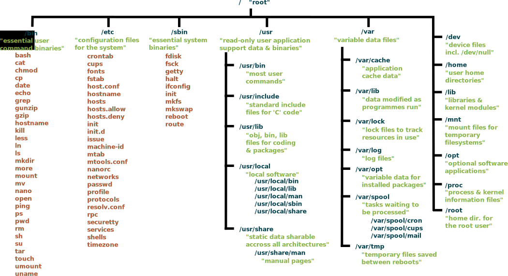
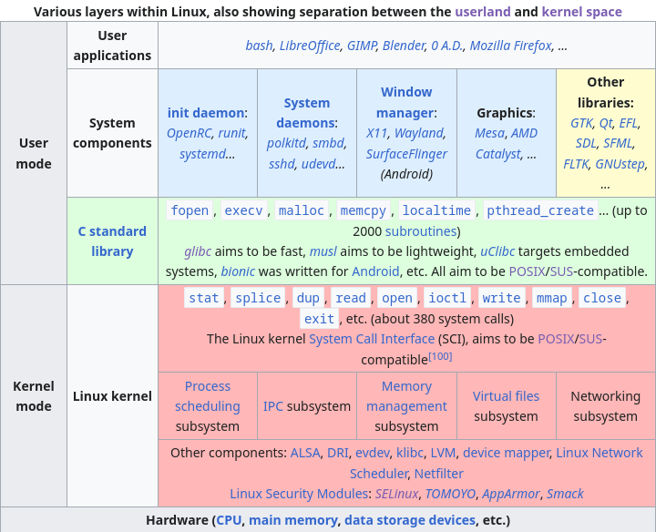

<!-- theme -->

<!-- Title page -->

# <!--fit--> Linux rabit hole
## Full course of Linux and the topics surrounding it
### By Ariel Parra.

---

# **1. What is Linux?**

---

# 1.1 Definition

It is an open-source monolithic kernel with GNU GPL v2 licence, used as the base of operating systems.

---

- What is a monolithic kernel? The kernel is software that has hardware control, manages and optimizes system resources such as RAM allocation, CPU processes, drivers, etc. Acting as a bridge between applications and hardware. It is monolithic when all system services operate in the system’s kernel with syscalls.
- What is open-source? It is software where anyone can see, analyze and therefore modify the source code.
- What's the GPLv2 license? It is a software license where any modification to the code must have the same license and for every binary file that is distributed, there has to be available source code.

---

# 1.2 History 

It was created in 1991 by the student of the University of Helsinki Linus Torvalds, at the same time Richard Stallman along with his GNU project of the Free Software Foundation (FSF) had already created the applications and utilities of an operating system. These applications and utilities were added to the Linux kernel to create a complete system called GNU/Linux.

---

# 1.3 linux Philosophy

The Linux philosophy is mainly based on UNIX and the open-source philosophies, where Linux is differentiated is by giving full control to the user, giving him the freedom to choose, study, modify and distribute any part of his operating system.

The Linux kernel it self, does not have binary blobs, but these are distributed in the Linux-firmware, this serves to initialize the hardware and drivers.

Linux has standards such as the LSB (Linux Standard Base) that define system interfaces and run times from where libraries and applications depend.
Linux operating systems often use the Filesystem Hierarchy Standard of linux.

---

# 1.4 Linux Filesystem Hierarchy Standard

Image recovered from [wikimedia](https://commons.wikimedia.org/wiki/File:Standard-unix-filesystem-hierarchy.svg)

---

# 1.5 Layers of Linux

Image recovered from [wikipedia](https://en.wikipedia.org/wiki/Template%3ALinux_layers)

---

# **2. Related topics**

---

# 2.1 UNIX

UNIX is an operating system created at the beginning of the 70s in AT&T by Dennis Ritchie (C language creator) and Ken Thompson (B language creator).
- POSIX: "Portable Operating System Interface", are a series of standards of use, given by the IEEE (Institute of Electrical and Electronics Engineers) which includes the I/O, the terminal, commands and networking. These standards are usually used to make shells compatibility scripts with many operating systems.
- Single UNIX Specification: It is a standard for operating systems to use the UNIX tredemark, with interfaces for C language, shell and commands.
- UNIX filosofy (Doug McIlroy): Write programs that do one thing very good, that work together (input is the output of another) and that handle streams (bytes strings for I/O), because they are a universal interface.
- Everything is a file, devices, keyboards, hard drives, etc. these are managed with streams and stored in the /dev folder.

---

# 2.2 Licenses 

Licences are licenses given by those who have the copyrght of the content, licenses can give you certain use permits depending on the licenses.

Copyright: Is a type of intellectual property that protects the original work of the author, giving the freedom to choose what can and can't be done with his work.

Copyleft: It is a strategy to use copyright to encourage the right to copy, share, modify and improve works under this license.

Public Domain: (No Rights Reserved)  is a license to opt out copyright.

---

Creative commons: they are free use licenses but with mandatory attribute, commonly used for images, videos and articles. , , , ,  and .

Open source licenses:
- [AGPL:](https://www.gnu.org/licenses/agpl-3.0.en.html) similar to GPL but for online services.
- [Apache](https://www.apache.org/licenses/LICENSE-2.0): include the copyright notice.
- BSD [2](https://opensource.org/license/bsd-2-clause/)/[3](https://opensource.org/license/bsd-3-clause/): include the copyright notice.
- GPL [v2](https://www.gnu.org/licenses/old-licenses/gpl-2.0.html)/[v3](https://www.gnu.org/licenses/gpl-3.0.html): source code available and copyleft.
- [MIT](https://opensource.org/license/mit/): include the copyright notice.  

---

# 2.3 Free/Libre Philosophy
 
The Free/Libre software philosophy is related to Richard Stallman and his GNU project, which says that software must respect the freedom of the user, freedom of distribution, freedom of use, freedom of study, etc. Going against Proprietary software and closed-source, binary blobs, non-permissive licenses and EULAs and DRM.

---

# 2.4 BSD

Berkeley Software Distribution, is an operating system created at the University of Berkeley in California, it is open source and originally was an extension of AT&T’s Research UNIX, unlike Linux this has the BSD C library, although they can share certain GNU utilities.

The two most important forks are:
- FreeBSD: is a ["large"](https://svnweb.freebsd.org/base/stable/12/) project with many forked operating systems departing from it, such as FreeNAS, pfsense, etc.
- OpenBSD: is a relatively more ["small"](https://cvsweb.openbsd.org/src/) than freebsd, it is [innovative](https://www.openbsd.org/innovations.html
) and creates new tools used throughout the unix community like ssh, while being one of the safest operating systems.

These may have certain [advantages and disadvantages](https://serverfault.com/questions/5267/what-is-good-about-the-bsds/5352#5352) regarding Linux.

---

# 2.5 Privacy 

I recommend this privacy [guide](https://www.privacyguides.org/en/) or the youtuber [Naomi Brockwell](https://yewtu.be/channel/UCSuHzQ3GrHSzoBbwrIq3LLA).
- [Duckduckgo](https://seonorth.ca/news/why-duckduckgo-is-bad/) It's not good.
- [Proton](https://techcrunch.com/2021/09/06/protonmail-logged-ip-address-of-french-activist-after-order-by-swiss-authorities/) is not reliable.
- VPNs do not give you [privacy](https://gist.github.com/joepie91/5a9909939e6ce7d09e29).
- People have [misconceptions](https://www.whonix.org/wiki/Tor_Myths_and_Misconceptions) about tor.

# 2.6 Security

I recommend this security [guide](https://wiki.archlinux.org/title/security) from arch wiki.
- Use the [Linux-hardened](https://github.com/anthraxx/linux-hardened) kernel.
- Use [selinux](https://selinuxproject.org/page/Main_Page) or [AppArmor](https://apparmor.net/) for access control.
- Do not use [Kali Linux](https://www.kali.org/docs/introduction/should-i-use-kali-linux/), as the main operating system.
- Use OpenBSD, as it is the most [secure](https://www.openbsd.org/security.html) unix system.

---

# 2.7 Minimalism

Minimalism regarding Linux, is about using and writing simple programs following the principles of UNIX and KISS, two ideas of minimalism are:
- Gnuless: some GNU programs may not be the most efficient or minimalist, a video about the theme: [Luke Smith: GNU is bloated!](https://yewtu.be/watch?v=nTCHapo8QFM), where he also talks about [harmfull cat -v](https://harmful.cat-v.org/software/) website which has extreme ideas regarding this topic.
- [Init freedom](https://www.devuan.org/os/init-freedom): systemd is the most used init system, but this does not follow the unix philosophy since systemd is not only the init system, since it has many other [functions](https://systemd-free.artixlinux.org/why.php) and tools, so using [alternatives](https://without-systemd.org/wiki/index_php/Main_Page/#other_UNIX-like) is [recommended](https://nosystemd.org/).

Websites that recommend minimalist software: [lukesmith](https://lukesmith.xyz/programs/) and [suckless.org](https://suckless.org/rocks/).

---

# 2.8 Ricing (Customization)

As Linux allows you to modify the system, you can modify it to all your artistic needs; color palettes such as [nord](https://www.nordtheme.com/) or [Catppuccin](https://github.com/catppuccin/palette) are used frecuently.

One of the best places to see, learn and share rices is [r/unixporn](https://reddit.com/r/unixporn/), where users share [dotfiles](https://wiki.archlinux.org/title/Dotfiles) which are the files that go in the user folder and have the configurations of the programs that will be customized, they are usually backed up on a git server.

You can also use a Linux distrubucion that already comes riced, such as [archcraft](https://archcraft.io/gallery.html) or you can use community scripts like [LARBS](https://larbs.xyz/).

---

# **3. Comparison of Operating Systems**

---

# 3.1 Linux Advantages  

- It's free (as in freedom and as in cost) and open source.
- Superiority in audio with [pipewire](https://pipewire.org/).
- You can boot [fast](https://www.forbes.com/sites/jasonevangelho/2019/06/19/infographics-linux-mint-challenges-windows-10-in-small-business-speed-tests-laptop/#7a560d2369bb) the system and applications.
- Less [compilation](https://medium.com/aedm/windows-wsl-and-linux-a-build-time-benchmark-for-java-rust-go-and-node-43188a9c77d6) times.
- Best results in [geekbench](https://yewtu.be/watch?v=7BreeFlhP78).
- Uses less memory [RAM](https://yewtu.be/watch?v=L3d9okxKcjM).
- It is a [portable](https://www.oreilly.com/library/view/linux-kernel-development/0672327201/ch19.html) operating system.
- It has multiple [communities](https://www.makeuseof.com/tag/4-helpful-communities-new-linux-users/) for support.
- It has official open-source GPU drivers for [AMD](https://gpuopen.com/amd-open-source-driver-for-vulkan/) and non-official [Nvidia](https://nouveau.freedesktop.org/).
- You can ["revive"](https://itsfoss.com/mystory-linux-13-years-laptop/) old laptops.
- Promotes [open source](https://www.linuxfoundation.org/resources/open-source-guides/participating-in-open-source-communities).
- You have freedom of choice over each component of the operating system.

----

# 3.2 More references of Linux advantages

- [linfo: 25 Reasons to Convert to Linux](http://www.linfo.org/reasons_to_convert.html)
- [Joe Collins: Linux vs. Windows | The Fundamental Differences](https://yewtu.be/watch?v=p4xA7GRmf6o)
- [Dave's Garage: Linux vs Windows Round 1: Open Source vs Proprietary - From a Retired Microsoft Dev](https://yewtu.be/watch?v=a9ZADRy5W0c)
- [DistroTube: How Linux Respects Your Privacy (And How Windows Does NOT!)](https://yewtu.be/watch?v=KarYADRAoTU)
- [Average Linux User: Linux advantages](https://yewtu.be/watch?v=mJEWPqHXNzs)
- [The Linux Foundation: Why are Linux Jobs so In Demand?](https://training.linuxfoundation.org/blog/why-are-linux-jobs-so-in-demand/)
- [The Linux Experiment: Windows, macOS & Linux PRIVACY compared: why do they need ALL THIS DATA?!](https://yewtu.be/watch?v=MMc5zgALLiY)
- [ForrestKnight:  Why I Code on Linux Instead of Windows](https://yewtu.be/watch?v=HrYtwz0Xe2Q)

---
# 3.3 Linux Disadvantages

- You have to learn new topics, learn to find solutions and read.
- You cannot run certain games: [rainbow six](https://www.protondb.com/app/359550), [roblox](https://news.itsfoss.com/roblox-linux-end/), [etc.](https://www.protondb.com/explore?sort=fixWanted)
- You can't run certain applications:[Adobe Photoshop](https://appdb.winehq.org/objectManager.php?sClass=application&iId=17), [MS Office](https://appdb.winehq.org/objectManager.php?sClass=application&iId=31), [etc](https://appdb.winehq.org/).
- Problems with [printers](https://opensource.com/article/21/8/add-printer-linux).
- No support for [HDR](https://wiki.archlinux.org/title/HDR_monitor_support).
- Problems with [variable refresh rate](https://wiki.archlinux.org/title/Variable_refresh_rate).
- Problems with [fractional scaling](https://wiki.archlinux.org/title/HiDPI).
- Screen tearing in [X11 (xorg)](https://christitus.com/fix-screen-tearing-linux/).
- Problems sharing audio screen in [discord](https://wiki.archlinux.org/title/Discord#Screen_sharing_with_audio) and [MS Teams](https://answers.microsoft.com/en-us/msteams/forum/all/sharing-system-sound-in-teams-for-linux/f1c70d83-e9bd-41b4-abde-d78fae764d5c).
- The nvidia open source driver has a [worst performance](https://openbenchmarking.org/result/2106300-IB-NOUVEAU2060) than the official one.
- The Windows compatibility layer (wine) can run [malware](https://wiki.winehq.org/FAQ#Is_Wine_malware-compatible.3F).

---

# 3.4 MacOS advantages

- It has interfaces with [innovative](https://design.tutsplus.com/tutorials/how-apple-ended-up-leading-the-icon-design-trends-and-whether-or-not-you-should-fight-it--cms-32201) designs.
- It has a [posix](https://www.opengroup.org/openbrand/register/apple.htm) certification.
- [Xcode](https://developer.apple.com/xcode/) to develop iOS/MacOS applications.
- Native games like [roblox](https://www.roblox.com/download) or Blizzard games like [WOW](https://www.blizzard.com/en-sg/download?platform=macos).
- Native applications such as [Adobe Photoshop](https://helpx.adobe.com/support/photoshop.html), [MS Office](https://www.microsoft.com/en-us/microsoft-365/mac/microsoft-365-for-mac), [FL Studio](https://www.image-line.com/), etc.
- Compatibility and use of [heic/hecv](https://support.apple.com/en-us/HT207022) integrated into the system.
- They have the [apple ecosystem](https://www.apple.com/macos/continuity/).
- They have the best [arm processors](https://www.techspot.com/review/2499-apple-m2/) for desktop and iOS apps support.
- Support for [HDR](https://support.apple.com/en-us/HT210980).
- You can share display with sound in [Discord](https://support.discord.com/hc/en-us/articles/1500006741102-macOS-Screen-Share-with-Audio-Update-FAQ) y [MS Teams](https://answers.microsoft.com/en-us/msteams/forum/all/sharing-system-sound-in-teams-for-linux/f1c70d83-e9bd-41b4-abde-d78fae764d5c).
- Good performance in DX12 games with [D3DMetal](https://developer.apple.com/metal/) and  [game porting toolkit](https://old.reddit.com/r/macgaming/comments/1446hj6/all_working_games_list_game_porting_toolkit/).

---

# 3.5 MacOS disadvantages

- Appple ID is a requirement to install MacOS.
- You cannot run certain [games](https://www.protondb.com/explore?sort=fixWanted).
- They removed the support of [32-bits](https://support.apple.com/en-us/HT208436) and thus many [apps](https://gist.github.com/stevemoser/a4388df17633beae5bc3fb07d38373e2).
- Limited [ofitial](https://everymac.com/systems/apple/index-apple-specs-applespec.html) and [unofitial](https://hackintosh.com/#hackintosh_compatible) hardware.
- Mac computers are [not cheap](https://everymac.com/global-mac-prices/mac-prices-mexico-mx.html).
- The existence of [OCSP](https://blog.jacopo.io/en/post/apple-ocsp/).
- Multiple [privacy](https://sneak.berlin/20201112/your-computer-isnt-yours/) concerns.
- Restrictive [Software License Agreements](https://www.apple.com/legal/sla/).
- Possible connections with NSA and involvement with [PRISM](https://www.washingtonpost.com/investigations/us-intelligence-mining-data-from-nine-us-internet-companies-in-broad-secret-program/013/06/06/3a0c0da8-cebf-11e2-8845-d970ccb04497_story.html).
- There are usually no open source drivers.
- The Windows compatibility layer (wine) can run [malware](https://wiki.winehq.org/FAQ#Is_Wine_malware-compatible.3F).
- It does not have volume controls by [apply](https://apple.stackexchange.com/questions/381397/is-it-possible-to-set-an-individual-sound-volume-for-each-program-on-a-mac).

---

# 3.6 Recomendaciones al usar MacOS

- Do not use an Apple ID account with your personal information.
- Use MacOS on a vm with NAT activated.
- Read this privacy [guide](https://github.com/drduh/macOS-Security-and-Privacy-Guide)  about MacOS.
- Use [alacritty](https://alacritty.org/) as a terminal emulator.
- Use [brew](https://brew.sh/) as a package manager.
- Avoid native MacOS applications.

---

# 9.4 Server projects

- Website with [nginx](https://ubuntu.com/tutorials/install-and-configure-nginx#1-overview)
- Password manager with [vaultwarden](https://github.com/dani-garcia/vaultwarden)
- Cloud storage with [nextcloud](https://nextcloud.com/)
- Cloud with AI for photos with [photoprism](https://docs.photoprism.app/getting-started/)
- Search engine with [searxng](https://docs.searxng.org/admin/installation.html#)
- VPN with [wireguard](https://www.wireguard.com/quickstart/)
- DNS controller with [pihole](https://docs.pi-hole.net/main/prerequisites/)
- Email server with [postfix](https://www.postfix.org/BASIC_CONFIGURATION_README.html)
- [etc](https://landchad.net/).

---

# **10. Aprender más acerca de Linux**

---

# 10.1 Guides and Websites

- [Arch wiki](https://wiki.archlinux.org/)
- [Gentoo wiki](https://wiki.gentoo.org/wiki/Main_Page)
- [Hack the box: learn Linux](https://www.hackthebox.com/blog/learn-linux)
- [EndevoarOs wiki](https://discovery.endeavouros.com/)
- [Machtelt Garrels: Introduction to Linux](https://tldp.org/LDP/intro-linux/intro-linux.pdf)
- [Linux journey](https://linuxjourney.com/)
- [Wikipedia: Linux portal](https://en.wikipedia.org/wiki/Portal:Linux)
- [Wikibooks: how Linux works](https://en.wikibooks.org/wiki/Linux_Guide/How_Linux_Works)
- [IBM: Learn Linux 101](https://developer.ibm.com/tutorials/l-lpic1-map/)
- [Linux foundation: introduction to Linux](https://training.linuxfoundation.org/training/introduction-to-linux/)
- [Kernel.org: Documentation](https://www.kernel.org/doc/)
- [Y más](https://itsfoss.com/learn-linux-for-free/)

---

# 10.2 Linux Youtubers I recommend

- [The linux experiment: Weekly news](https://yewtu.be/channel/UC5UAwBUum7CPN5buc-_N1Fw)
- [DistroTube: Distro reviews, reviews and tutorials](https://yewtu.be/channel/UCVls1GmFKf6WlTraIb_IaJg)
- [Luke Smith: Opinions, recommendations and tutorials](https://yewtu.be/channel/UC2eYFnH61tmytImy1mTYvhA)
- [Mental Outlaw: Opinions and news](https://yewtu.be/channel/UC7YOGHUfC1Tb6E4pudI9STA)
- [Michael Horn: Linux tips](https://yewtu.be/channel/UC1s1OsWNYDFgbROPV-q5arg)
- [Wolfgang's: Server tips](https://yewtu.be/channel/UCsnGwSIHyoYN0kiINAGUKxg)
- [Hardware Haven: Server hardware](https://yewtu.be/channel/UCgdTVe88YVSrOZ9qKumhULQ)
- [More](https://yewtu.be/watch?v=NybbsnDT5NI faket=316s)

---

# **11. References**

---

