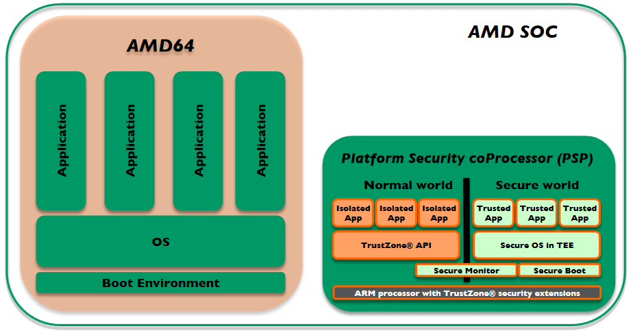
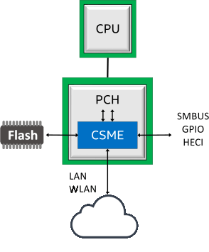
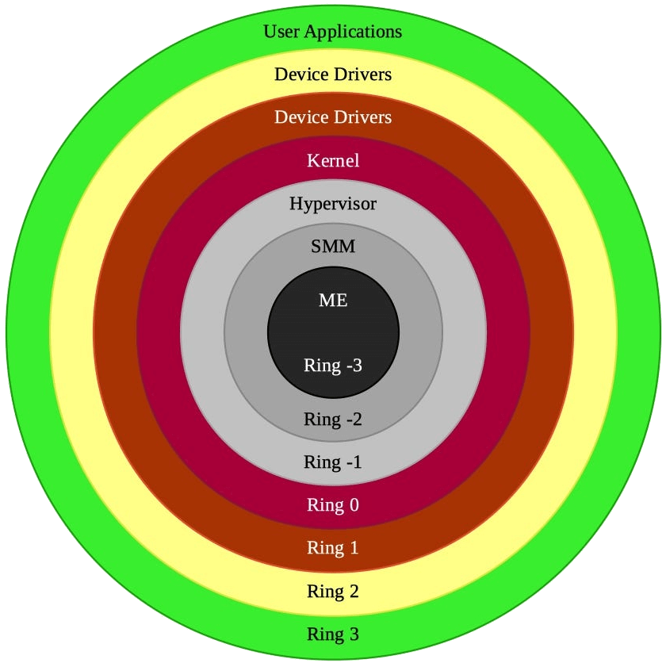

<!-- HTML Enabled in Marp Markdown-->

# <!--fit--> Linux rabit hole
## Curso completo de Linux y los temas que lo rodean
### Por Ariel Parra.

---

<!-- tema -->

# **1. ¿Qué es Linux?**

---

# 1.1 Definición

Es un kernel monolítico de código abierto con licencia GNU GPL v2, usado como base de sistemas operativos.

---

<mark>¿Qué es un kernel monolítico?</mark> El kernel es software que tiene el control del hardware, administra y optimiza los recursos del sistema como asignación de memoria RAM, procesos del CPU, drivers, etc. Actuando, así como un puente entre aplicaciones y el hardware. Este es monolítico cuando todos los servicios del sistema operan en el kernel atreves de system calls. 
<mark>¿Qué es el código abierto?</mark> Es software donde cualquier persona puede ver, analizar y por ende modificar el código fuente.
<mark>¿Cuál es la licencia GPLv2?</mark> Es una licencia de software donde cualquier modificación al código debe tener la misma licencia y también que por cada archivo binario que sea distribuido tiene que estar disponible su código fuente. 

---

# 1.2 Historia 

Fue creado en 1991 por el estudiante de la universidad de Helsinki Linus Torvalds, al mismo tiempo Richard Stallman junto con su proyecto GNU de la fundación de software libre (FSF) ya habían creado las aplicaciones y utilidades de un sistema operativo. Estas aplicaciones y utilidades fueron agregadas al Linux kernel para crear un systema completo llamado GNU/Linux.

---

# 1.3 Filosofia de linux

La filosofía de Linux se basa principalmente en la filosofía de UNIX y del open-source, donde Linux se diferencia es al darle control completo al usuario, dándole la libertad de elegir, estudiar, modificar y distribuir cualquier parte de su sistema operativo. 

El kernel de Linux en si no tiene blobs binarios, sino que estos son distribuidos en el Linux-firmware, esto sirve para inicializar el hardware y los drivers. 

Linux tiene estándares como el LSB (Linux Standard Base) que define system interfaces y run times de donde las librerías y aplicaciones dependen, un Open Container Initiative (OCI) para especificaciones de runtimes, imagenes y distribución. Los sistemas operativos Linux suelen usar el Filesystem Hierarchy Standard de linux.

---

# 1.4 Linux Filesystem Hierarchy Standard

Imagen recuperada de [wikimedia](https://commons.wikimedia.org/wiki/File:Standard-unix-filesystem-hierarchy.svg)

---

# 1.5 las capas de Linux

Imagen recuperada de [wikipedia](https://en.wikipedia.org/wiki/Template%3ALinux_layers)

---

# **2. temas relacionadas**

---

# 2.1 UNIX

UNIX es un sistema operativo creado a principios de los 70s en AT&T por Dennis Ritchie (creador del lenguaje C) y Ken Thompson (creador del lenguaje B).
- POSIX: "Portable Operating System Interface", son una serie de estándares de uso, impuestos por el IEEE (Institute of Electrical and Electronics Engineers) que incluye el I/O, la terminal, comandos y redes. Estos estandares se suele usar para hacer shell scripts compatibiles con muchos sistemas operativos.
- Single UNIX Specification: Es un estándar para sistemas operativos para usar el tredemark de UNIX , con interfaces para el lenguaje C, el shell y comandos.
- UNIX filosofy (Doug McIlroy): Escribe programas que hagan una cosa muy bien, que trabajen juntos (input de uno es el output de otro) y que manejen streams (serie de bytes para I/O), porque son  una interfaz universal.
- Todo es un archivo, los dispositivos, teclados, discos duros, etc. estos son manejados con streams y almacenados en la carpeta /dev .

---

# 2.2 Licencias 

Las licencias son permisos dados por quien tiene el copyrght del contenido, las licencias pueden darte ciertos permisos de uso dependiendo de las licencias.

<mark>Copyright:</mark> El derecho de autor (copyright) es un tipo de propiedad intelectual que protege las obras originales del autor, dando la libertad de elegir que se hace o que no se hace con su obra.

<mark>Copyleft:</mark> Es una estrategia para usar el copyright para fomentar el derecho de copiar, compartir, modificar y mejorar las obras bajo esta licencia.

<mark>Dominio Publico:</mark> (No Rights Reserved)  es una licencia para deslindarte de los derechos de autor.

---

<mark>Creative commons:</mark> son licencias de uso libre pero con atribucion obligatoria, comunmente usados para imagenes, videos y articulos. , , , ,  y .

Licencias open-source más comunes:  
- [AGPL:](https://www.gnu.org/licenses/agpl-3.0.en.html) similar al GPL pero para servicios en linea.
- [Apache](https://www.apache.org/licenses/LICENSE-2.0): incluir la nota de copyright.  
- BSD [2](https://opensource.org/license/bsd-2-clause/)/[3](https://opensource.org/license/bsd-3-clause/): incluir la nota de copyright. 
- GPL [v2](https://www.gnu.org/licenses/old-licenses/gpl-2.0.html)/[v3](https://www.gnu.org/licenses/gpl-3.0.html): codigo fuente disponible y copyleft.
- [MIT](https://opensource.org/license/mit/): incluya la nota de copyright.  

---

# 2.3 Filosofia de software libre
 
La filosofía de software libre tiene relación con Richard Stallman y su proyecto GNU, esta dice que software debe respetar la libertad del usuario, la libertad de distribución, la libertad de uso, la libertad de estudio, etc. Yendo en contra del software privado y con código cerrado, los blobs binarios, las licencias y EULAs no permisivas y el DRM. 

---

# 2.4 BSD

Berkeley Software Distribution, es un sistema operativo creado en la universidad de Berkeley en California, de código abierto y originalmente extensión de AT&T’s Research UNIX, a diferencia de Linux este tiene la BSD C library, aunque pueden compartir ciertas utilidades de GNU.

Los dos forks más importantes son:
- <mark>FreeBSD:</mark> es un proyecto ["grande"](https://svnweb.freebsd.org/base/stable/12/) con muchos sistemas operativos forkeados apartir de el, como FreeNAS, pfsense, etc.
- <mark>OpenBSD:</mark> es un proyecto relativamente más ["pequeño"](https://cvsweb.openbsd.org/src/) que freebsd, es [inovador](https://www.openbsd.org/innovations.html
) y crean nuevas herramientas usadas en toda la comunidad unix como ssh, mientras que es de los sistemas operativos más seguros.

Estos pueden tener ciertas [ventajas y desventajas](https://serverfault.com/questions/5267/what-is-good-about-the-bsds/5352#5352) respecto a Linux.

---

# 2.5 Privacidad 

Recominedo esta [guia](https://www.privacyguides.org/en/) de privacidad o tambien a la youtuber [Naomi Brockwell](https://yewtu.be/channel/UCSuHzQ3GrHSzoBbwrIq3LLA).
- [Duckduckgo](https://seonorth.ca/news/why-duckduckgo-is-bad/) no es bueno.
- [Proton](https://techcrunch.com/2021/09/06/protonmail-logged-ip-address-of-french-activist-after-order-by-swiss-authorities/) no es confiable.
- Las VPN no te dan [privacidad](https://gist.github.com/joepie91/5a9909939e6ce7d09e29).
- La gente esta [desinformada](https://www.whonix.org/wiki/Tor_Myths_and_Misconceptions) acerca de tor.

# 2.6 Seguridad

Recomiendo esta [guia](https://wiki.archlinux.org/title/security) de seguridad de la arch wiki.
- Usa el [Linux-hardened](https://github.com/anthraxx/linux-hardened) kernel.
- Usa [selinux](https://selinuxproject.org/page/Main_Page) o [AppArmor](https://apparmor.net/) para el control de acceso.
- No uses [Kali Linux](https://www.kali.org/docs/introduction/should-i-use-kali-linux/), como sistema operativo principal.
- Usa OpenBSD, ya que es el sistema unix más [seguro](https://www.openbsd.org/security.html).

---

# 2.7 Minimalismo

El minimalismo en cuestion de Linux, se trata de usar y escribir programas simples siguiendo principios de UNIX y KISS,  dos ideas deribadas del minimalismo son:
- <mark>Gnuless:</mark> algunos programas de GNU pueden no ser los más eficientes o minimalistas, un video acerca del tema: [Luke Smith: GNU is bloated!](https://yewtu.be/watch?v=nTCHapo8QFM), donde se habla tambien de la página web [harmfull cat -v](https://harmful.cat-v.org/software/) la cual tiene ideas extremas.
- <mark>[Init freedom](https://www.devuan.org/os/init-freedom):</mark> systemd es el init system más usado, pero este no sigue la filosofia de unix ya que systemd no solo es el init system, ya que tiene muchas otras [funciones](https://systemd-free.artixlinux.org/why.php) y herramientas, por lo que usar [alternativas](https://without-systemd.org/wiki/index_php/Main_Page/#other_UNIX-like) es [recomendado](https://nosystemd.org/).

Páginas web que recomiendan software minimalista: [lukesmith](https://lukesmith.xyz/programs/) y [suckless.org](https://suckless.org/rocks/).

---

# 2.8 Ricing (Personalización)

Como Linux te permite modificar el sistema, puedes configurarlo a todos tus gustos artisticos; se suelen usar paletas de colores como [nord](https://www.nordtheme.com/) o [Catppuccin](https://github.com/catppuccin/palette).

Uno de los mejores lugares para ver, aprender y compartir rices es  [r/unixporn](https://reddit.com/r/unixporn/), donde los usuarios comparten [dotfiles](https://wiki.archlinux.org/title/Dotfiles) que son los archivos que van en la carpeta de usuario y tienen las configuraciones de los programas que se van a costumizar, usualmente son respaldados en un servidor de git.

Tambien puedes usar una distrubucion de Linux que ya venga riceada, como [archcraft](https://archcraft.io/gallery.html) o puedes usar scripts de la comunidad como [LARBS](https://larbs.xyz/).

---

# **3. Comparación de Sistemas operativos**

---

# 3.1 Ventajas de Linux 

- Es gratuito y open-source.
- Superioridad en cuestion de audio con [pipewire](https://pipewire.org/).
- Puede arrancar [rapidamente](https://www.forbes.com/sites/jasonevangelho/2019/06/19/infographics-linux-mint-challenges-windows-10-in-small-business-speed-tests-laptop/#7a560d2369bb) el sistema y las aplicaciones.
- Tiempos menores de [compilacion](https://medium.com/aedm/windows-wsl-and-linux-a-build-time-benchmark-for-java-rust-go-and-node-43188a9c77d6)
- Mejores resultados en [geekbench](https://yewtu.be/watch?v=7BreeFlhP78).
- Usa menos memoria [RAM](https://yewtu.be/watch?v=L3d9okxKcjM).
- Es un sistema operativo [portable](https://www.oreilly.com/library/view/linux-kernel-development/0672327201/ch19.html).
- Tiene multiples [comunidades](https://www.makeuseof.com/tag/4-helpful-communities-new-linux-users/) para soporte.
- Tiene GPU drivers open-source de [AMD](https://gpuopen.com/amd-open-source-driver-for-vulkan/), [Intel](https://www.intel.com/content/www/us/en/developer/articles/technical/intel-open-source-graphics-drivers-and-vulkan-graphics-api.html) y [Nvidia](https://nouveau.freedesktop.org/).
- Puedes ["revivir"](https://itsfoss.com/mystory-linux-13-years-laptop/) laptops antiguas.
- Promueve el [open-source](https://www.linuxfoundation.org/resources/open-source-guides/participating-in-open-source-communities).
- Tienes libertad de elección sobre cada componente del sistema operativo.

----

# 3.2 Más referencias de las ventajas de Linux 

- [linfo: 25 Reasons to Convert to Linux](http://www.linfo.org/reasons_to_convert.html)
- [Joe Collins: Linux vs. Windows | The Fundamental Differences](https://yewtu.be/watch?v=p4xA7GRmf6o)
- [Dave's Garage: Linux vs Windows Round 1: Open Source vs Proprietary - From a Retired Microsoft Dev](https://yewtu.be/watch?v=a9ZADRy5W0c)
- [DistroTube: How Linux Respects Your Privacy (And How Windows Does NOT!)](https://yewtu.be/watch?v=KarYADRAoTU)
- [Average Linux User: Linux advantages](https://yewtu.be/watch?v=mJEWPqHXNzs)
- [The Linux Foundation: Why are Linux Jobs so In Demand?](https://training.linuxfoundation.org/blog/why-are-linux-jobs-so-in-demand/)
- [The Linux Experiment: Windows, macOS & Linux PRIVACY compared: why do they need ALL THIS DATA?!](https://yewtu.be/watch?v=MMc5zgALLiY)
- [ForrestKnight:  Why I Code on Linux Instead of Windows](https://yewtu.be/watch?v=HrYtwz0Xe2Q)

---
# 3.3 Desventajas de Linux

- Tienes que aprender temas nuevos, aprender a buscar soluciones y leer.
- No puedes correr ciertos juegos: [rainbow six](https://www.protondb.com/app/359550), [roblox](https://news.itsfoss.com/roblox-linux-end/), [etc.](https://www.protondb.com/explore?sort=fixWanted)
- No puedes correr ciertas aplicaciones: [Adobe Photoshop](https://appdb.winehq.org/objectManager.php?sClass=application&iId=17), [MS Office](https://appdb.winehq.org/objectManager.php?sClass=application&iId=31), [etc](https://appdb.winehq.org/).
- Problemas con [impresoras](https://opensource.com/article/21/8/add-printer-linux).
- Sin soporte para [HDR](https://wiki.archlinux.org/title/HDR_monitor_support).
- Problemas con [variable refresh rate](https://wiki.archlinux.org/title/Variable_refresh_rate).
- Problemas con [fractional scaling](https://wiki.archlinux.org/title/HiDPI).
- Screen tearing en [X11 (xorg)](https://christitus.com/fix-screen-tearing-linux/).
- Problemas al compartir pantalla con audio en [discord](https://wiki.archlinux.org/title/Discord#Screen_sharing_with_audio) y [MS Teams](https://answers.microsoft.com/en-us/msteams/forum/all/sharing-system-sound-in-teams-for-linux/f1c70d83-e9bd-41b4-abde-d78fae764d5c).
- El driver open-source de nvidia tiene un [peor rendimiento](https://openbenchmarking.org/result/2106300-IB-NOUVEAU2060) que el oficial.
- La capa de compatibilidad con Windows (wine) puede correr [malware](https://wiki.winehq.org/FAQ#Is_Wine_malware-compatible.3F).

---

# 3.4 Ventajas de MacOS

- Tiene interfaces con diseños [inovadores](https://design.tutsplus.com/tutorials/how-apple-ended-up-leading-the-icon-design-trends-and-whether-or-not-you-should-fight-it--cms-32201).
- Tiene una certificación [posix](https://www.opengroup.org/openbrand/register/apple.htm).
- [Xcode](https://developer.apple.com/xcode/) para desarrollar aplicaciones de iOS/MacOS.
- Juegos nativos como [roblox](https://www.roblox.com/download) o juegos de Blizzard como [WOW](https://www.blizzard.com/en-sg/download?platform=macos).
- Aplicaciones nativas como [Adobe Photoshop](https://helpx.adobe.com/support/photoshop.html), [MS Office](https://www.microsoft.com/en-us/microsoft-365/mac/microsoft-365-for-mac), [FL Studio](https://www.image-line.com/), etc.
- Compatibilidad y uso de [heic/hecv](https://support.apple.com/en-us/HT207022) integrado al sistema.
- Tienen el [ecosistema de apple](https://www.apple.com/macos/continuity/).
- Tienen de los mejores [procesadores arm](https://www.techspot.com/review/2499-apple-m2/) para escritorio y soporte de aplicaciones de iOS.
- Soporte de [HDR](https://support.apple.com/en-us/HT210980).
- Puedes compartir pantalla con sonido en [Discord](https://support.discord.com/hc/en-us/articles/1500006741102-macOS-Screen-Share-with-Audio-Update-FAQ) y [MS Teams](https://answers.microsoft.com/en-us/msteams/forum/all/sharing-system-sound-in-teams-for-linux/f1c70d83-e9bd-41b4-abde-d78fae764d5c).
- Buen rendimiento en juegos DX12 con [D3DMetal](https://developer.apple.com/metal/) y  [game porting toolkit](https://old.reddit.com/r/macgaming/comments/1446hj6/all_working_games_list_game_porting_toolkit/).

---

# 3.5 Desventajas de MacOS

- Appple ID es un requisito para instalar MacOS.
- No puede correr ciertos [juegos](https://www.protondb.com/explore?sort=fixWanted).
- Quitaron el soporte de [32-bits](https://support.apple.com/en-us/HT208436) y con eso muchas [apps](https://gist.github.com/stevemoser/a4388df17633beae5bc3fb07d38373e2).
- Hardware [oficial](https://everymac.com/systems/apple/index-apple-specs-applespec.html) y [no oficial](https://hackintosh.com/#hackintosh_compatible) limitados.
- Las computadoras Mac son [costosas](https://everymac.com/global-mac-prices/mac-prices-mexico-mx.html).
- La existencia de [OCSP](https://blog.jacopo.io/en/post/apple-ocsp/).
- Múltiples  problemas de [privacidad](https://sneak.berlin/20201112/your-computer-isnt-yours/).
- [Contratos de licencia de software](https://www.apple.com/legal/sla/) restrictivos.
- Posibles conexiones con NSA e implicación con [PRISM](https://www.washingtonpost.com/investigations/us-intelligence-mining-data-from-nine-us-internet-companies-in-broad-secret-program/013/06/06/3a0c0da8-cebf-11e2-8845-d970ccb04497_story.html).
- No suele haber drivers open-source.
- La capa de compatibilidad con Windows (wine) puede correr [malware](https://wiki.winehq.org/FAQ#Is_Wine_malware-compatible.3F).
- No tiene controles de volumen por [aplicación](https://apple.stackexchange.com/questions/381397/is-it-possible-to-set-an-individual-sound-volume-for-each-program-on-a-mac).

---

# 3.6 Recomendaciones al usar MacOS

- No uses una cuenta de Apple ID con tus datos personales.
- Usa MacOS en una vm con NAT activado.
- Lee esta [guia](https://github.com/drduh/macOS-Security-and-Privacy-Guide) de privacidad en MacOS.
- Usa [alacritty](https://alacritty.org/) como emulador terminal.
- Usa [brew](https://brew.sh/) como package manager.
- Evita aplicaciones nativas de MacOS.

---

# 3.7 Ventajas de Windows

- Compatibilidad perfecta con [DirectX](https://www.microsoft.com/en-us/download/details.aspx?id=35). 
- [Compatibilidad](https://support.microsoft.com/en-us/windows/make-older-apps-or-programs-compatible-with-windows-783d6dd7-b439-bdb0-0490-54eea0f45938) con aplicaciones antiguas de windows. 
- Las empresas les importa la distribución del [mercado](https://gs.statcounter.com/os-market-share/desktop/worldwide/#monthly-202306-202306-bar) de sistemas operativos, por lo que ciertas aplicaciones y juegos están pensados solo para Windows.  
- Soporte de [HDR](https://support.microsoft.com/en-us/windows/hdr-settings-in-windows-2d767185-38ec-7fdc-6f97-bbc6c5ef24e6). 
- Grabar clips con [Game DVR](https://support.microsoft.com/en-us/windows/record-a-game-clip-on-your-pc-with-xbox-game-bar-2f477001-54d4-1276-9144-b0416a307f3c)
- Windows Subsystem for Linux [(WSL)](https://learn.microsoft.com/en-us/windows/wsl/about) y Windows Subsystem for Android [(WSA)](https://learn.microsoft.com/en-us/windows/android/wsa/). 
 
---

# 3.8 Desventajas de Windows

---

## 3.8.1 Desarrollador

- [Java updater](https://www.java.com/en/download/help/java_update.html) esta siempre activo en segundo plano.
- Ejecuta programas de manera lenta (a tirones) aunque sea con powershell.
- Hyper-V, Windows hypervisor platform, BitLocker, Group Policy Editor y Remote Desktop solo estan disponibles para [Windows Pro](https://www.microsoft.com/en-us/windows/compare-windows-10-home-vs-pro).
- Virtual Machine Platform, Hyper-V, Windows hypervisor platform y WSL2 interfieren con aplicaciones: [dell alienware control](https://www.dell.com/community/Alienware-Desktops/AWCC-OC-Controls-incompatible-with-Virtual-Machine-Platform/m-p/8239494#M60811), [throttle stop](https://www.techpowerup.com/forums/threads/throttlestop-dead-on-windows-11.284102/), etc.
- Los hosts en Windows son [read-only](https://superuser.com/questions/958991/windows-10-cant-edit-hosts-file) y modificarlo puede alertar al [antivirus](https://support.microsoft.com/en-au/topic/hosts-file-is-detected-as-malware-in-windows-defender-4320fa8b-0d54-1129-db85-61f095144521).
- Para correr un ["hello world!"](https://stackoverflow.com/questions/55603111/unable-to-compile-rust-hello-world-on-windows-linker-link-exe-not-found) de rust ocupas que descargar visual studio community junto con 1gb para los c++ build tools y el Windows SDK.
- Visual studio community usa como [10gb](https://developercommunity.visualstudio.com/t/visual-studio-uses-too-disk-much-space/145475) o [más](https://developercommunity.visualstudio.com/t/hard-disk-space-loss/585904).
- Problemas con librerías, a veces tienes que compilarlas manualmente como [pycripto](https://old.reddit.com/r/webdev/comments/132eql/owhy_many_people_dislike_windows_as_an_development/) o en mi caso librespot de rust.
- Problemas de velocidad con [I/O y ntfs](https://github.com/Microsoft/WSL/issues/873).

---

## 3.8.2 Uso general

- Las apps por defecto se actualizan individualmente ya sea abriendo la aplicación o teniendo que descargar la nueva versión de la página del creador.
- Para usar winget ocupas una cuenta Microsoft para descargar [App-Installer](https://apps.microsoft.com/store/detail/appinstaller/9NBLGGH4NNS1?hl=de-at&gl=at&rtc=1) de la microsoft store y para usarlo ocupas constantemente aceptar los [UAC](https://learn.microsoft.com/en-us/windows/package-manager/winget/) prompts, aparte de aceptar la [CLA](https://opensource.microsoft.com/cla/).
- No puedes nombrar archivos con ciertos [nombres](https://yewtu.be/watch?v=bC6tngl0PTI).
- Windows pro cuesta [$6399](https://www.microsoft.com/es-mx/d/windows-11-pro/dg7gmgf0d8h4) pesos MXN.
- windows 11 [requiere](https://learn.microsoft.com/en-us/windows/whats-new/windows-11-requirements) a tener una cuenta Microsoft y usarla en tu sistema.
- El sistema operativo se expande hasta más de [40gb](https://superuser.com/questions/1467359/windows-takes-up-40gb-of-disk-space).
- El buscador de windows es [ineficiente](https://computerinfobits.com/why-is-windows-10-search-so-bad/).
- Prefetch y superfetch (SysMain), suelen tener el disco duro al [100%](https://yewtu.be/watch?v=MmH4tjH2yMc) de uso.

---

- Suele haber más [virus](https://www.howtogeek.com/141944/htg-explains-why-windows-has-the-most-viruses/) que macOS o Linux  
- aplicaciones freeware pueden tener virus como [atubecatcher](https://old.reddit.com/r/antivirus/comments/snqipr/is_atube_catcher_a_virus/), etc. 
- La Microsoft store tiene aplicaciones más aplicaciones [.appx](https://learn.microsoft.com/en-us/uwp/schemas/appxpackage/uapmanifestschema/schema-root) que .exe 
- Tienes que pagar para poder usar archivos [HEVC](https://apps.microsoft.com/store/detail/hevc-video-extensions/9NMZLZ57R3T7?hl=en-us&gl=us&activetab=pivot%3Aoverviewtab) 
- Windows incluye [bloatware](https://www.digitalcitizen.life/windows-10-bloatware/) 
- Los antivirus pueden bloquear aplicaciones/servicios en el [firewall](https://www.mcafee.com/support/?locale=en-US&articleId=TS102946&page=shell&shell=article-view)  
- Windows Antimalware Service puede usar [100%](https://answers.microsoft.com/en-us/windows/forum/all/high-cpu-usage-by-antimalware-service-executable/4f6f635a-b3ad-444c-8cd0-68fb1e9f4bfa) del CPU 
- Problemas en pantallas con [high dpi](https://support.microsoft.com/en-gb/topic/windows-scaling-issues-for-high-dpi-devices-508483cd-7c59-0d08-12b0-960b99aa347d) dando lugar a [apps borrosas](https://support.microsoft.com/en-us/windows/fix-apps-that-appear-blurry-in-windows-10-e9fe34ab-e7e7-bc6f-6695-cb169b51de0f) 
- La solución a la mayoria de errores es [reinstalar](https://answers.microsoft.com/en-us/windows/forum/all/windows-update-system-restore-and-repair-failed/aaf28405-55c0-4ee2-b4b4-f13571680b32) el sistema operativo 
- Las [apps](https://www.pcmag.com/how-to/stop-windows-10-apps-from-launching-at-startup) se ejecutan al inicio o crean servicios que se ejecutan al inicio 
- Fondos de pantalla en slidehow puede no [funcionar](https://answers.microsoft.com/en-us/windows/forum/all/background-slideshow-stops-working/acfcabe4-56fb-436a-afc6-42bdd877ca29) 
- Pocas opciones open-source de [customizacion](https://github.com/Awesome-Windows/Awesome#customization) y algunas opciones privadas cuestan [wallpaperengine](https://store.steampowered.com/app/431960/Wallpaper_Engine/), [taskbarX](https://apps.microsoft.com/store/detail/taskbarx/9PCMZ6BXK8GH?hl=en-us&gl=us), [start11](https://www.stardock.com/products/start11/), etc. 

---

## 3.8.3 Hardware

- Device encryption ocupa hardware [moderno](https://www.microsoft.com/en-us/windows/compare-windows-10-home-vs-pro) ([InstantGo](https://blogs.windows.com/windowsexperience/2014/06/19/instantgo-a-better-way-to-sleep/#RXGeiruxOD7f3V0q.97)/[AOAC](https://www.microsoft.com/en-us/store/b/alwaysconnectedfaq)/[HSTI-compliant](https://learn.microsoft.com/en-us/windows-hardware/test/hlk/testref/hardware-security-testability-specification)), basicamente de 2014 en adelante.
- Los [requisitos](https://www.microsoft.com/en-us/windows/windows-11-specifications) de Windows 11, procesador de 64 bits, UEFI, TPM v2.0 y una grafica compatible con DirectX12.
- Los discos duros con NTFS tienen que [defragmentarse](https://learn.microsoft.com/en-us/previous-versions/cc767961(v=technet.10)).
- Los drivers oficiales de Nvidia tienen [telemetría](https://www.geeks3d.com/20161107/nvidia-telemetry-in-geforce-drivers/).
- No suele haber drivers open-source.

---

## 3.8.4 Juegos

- Descargas [muchas versiones](https://www.howtogeek.com/256245/why-are-there-so-many-microsoft-visual-c-redistributables-installed-on-my-pc/) de microsoft visual c++ redistributable por juego.
- Los juegos de la microsoft store (xbox app) suelen correr [peor](https://old.reddit.com/r/techsupport/comments/v4nhaf/so_ive_been_wondering_if_its_just_me_or_windows/) o dar [input lag](https://www.reddit.com/r/roblox/comments/oahvsf/roblox_player_vs_microsoft_store_app_input_lag/).
- No puedes acceder a las [carpetas](https://www.makeuseof.com/windows-access-windowsapps-folder/) de juegos de la microsoft store (xbox app) aun siendo administrador.
- Juegos antiguos en discos no [funcionan](https://answers.microsoft.com/en-us/windows/forum/all/older-disc-games-wont-work-on-windows-10/1ffb7eb3-b634-418a-a2f5-1b0055b6bbf7).

---

## 3.8.5 Privacidad

- Opciones anti privacidad activados por [defecto](https://learn.microsoft.com/es-es/intune-education/media/rs5_choose_settings.png).
- Windows [phone home](https://yewtu.be/watch?v=IT4vDfA_4NI).
- Windows esta implicado con la [NSA](http://techrights.org/wiki/index.php/Microsoft_and_the_NSA) y [PRISM](https://en.wikipedia.org/wiki/PRISM).
- Datos de diagnóstico [obligatorios](https://learn.microsoft.com/en-us/windows/privacy/required-windows-diagnostic-data-events-and-fields-2004).
- [Edge](https://learn.microsoft.com/en-us/microsoft-edge/privacy-whitepaper/) y [office](https://learn.microsoft.com/en-us/deployoffice/compat/data-that-the-telemetry-agent-collects-in-office) envían telemetría.
- [Delivery Optimization](https://learn.microsoft.com/en-us/windows/deployment/do/waas-delivery-optimization) esta activado por [defecto](https://www.dell.com/support/kbdoc/es-mx/000125580/information-on-the-windows-update-delivery-optimization-feature-within-windows-10?lang=en).

---

# 3.9 Más referencias de las desventajas de windows
- [GNU: Microsoft's Software is Malware](https://www.gnu.org/proprietary/malware-microsoft.en.html)
- [Jody Bruchon Tech: Windows 11 Must Be Stopped - A Veteran PC Repair Shop Owner's Dire Warning](https://yewtu.be/watch?v=LcafzHL8iBQ)
- [reddit: why many people dislike windows as an development environment?](https://old.reddit.com/r/webdev/comments/132eql/why_many_people_dislike_windows_as_an_development/)
- [reddit: what is your worst experience with ms windows?](https://old.reddit.com/r/linuxmasterrace/comments/u19uee/what_is_your_worst_experience_with_ms_windows/)
- [reddit: why so much hate to windows?](https://old.reddit.com/r/linuxmasterrace/comments/qi370x/why_so_much_hate_to_windows/)
- [Wikipedia: Criticism of Microsoft](https://en.wikipedia.org/wiki/Criticism_of_Microsoft)
- [installgentoo wiki: Windows](https://wiki.installgentoo.com/wiki/Windows)
- [installgentoo wiki: Windows 10](https://wiki.installgentoo.com/wiki/Windows_10)
- [itvision blog: why windows 10 sucks](https://itvision.altervista.org/why-windows-10-sucks.html)
- [itvision blog: why windows 11 sucks](https://itvision.altervista.org/why-windows-11-sucks.html)

---

# 3.10 Recomendaciones al usar windows

- Usa Windows 10 sin iniciar sesión con una cuenta de Microsoft.
- Descarga apps de la ms store con https://store.rg-adguard.net/ .
- Usa [PowerToys](https://github.com/microsoft/PowerToys) para mejorar la experiencia de uso.
- Si usas Windows en una vm con NAT usa [WinApps](https://github.com/Fmstrat/winapps).
- Si usas una gráfica Nvidia, instala drivers sin telemetría con [nvcleanstall](https://www.techpowerup.com/download/techpowerup-nvcleanstall/).
- Si es para jugar, preinstala todos los Visual C++ desde [techpowerup](https://www.techpowerup.com/download/visual-c-redistributable-runtime-package-all-in-one/).
- Usa [Chris Titus Tech's Windows Utility](https://github.com/ChrisTitusTech/winutil) para desactivar fácilemente telemetría o también para activar UTC si se usa Windows en dual-boot.
- Bloquea las direcciones a donde se envian telemetrias en el archivo de [hosts](https://gist.github.com/VirtuBox/f09968a2d27bc00ba58b3617c61dc54e).
- Prueba que el software descargado de internet no tenga virus con [virustotal](https://www.virustotal.com/gui/).
- Usa aplicaciones con posibles virus en [sandboxie plus](https://sandboxie-plus.com/)
- [autoruns](https://learn.microsoft.com/en-us/sysinternals/downloads/autoruns) para desactivar apps/servicios al inicio del sistema.
- Usa [alacritty](https://alacritty.org/) como emulador terminal y usa [scoop](https://scoop.sh/) como package manager.

---

# **4. Distribuciones de Linux**

---

# 4.1 ¿Qué es una distribucion de Linux?

Una distribución (distro) de Linux es un sistema operativo completo con muchos componentes open-source, utilidades e interfaces.

---

# 4.2 Componentes de una distrubucion de Linux

Los componentes y características que construyen a una distribución de linux son: 
- Filosofia: KISS/minimalismo, free/libre, bsd userspace, compilación, etc.
- Uso: juegos, media, privacidad, seguridad, escolar, etc.
- Release model: fix, rolling release, lts, bleeding edge
- Boot Loader: GRUB, Syslinux, LILO, systemd-boot, etc.
- Tipo de kernel: Stable (vanilla), zen, libre, LTS, Realtime, etc.
- Init system / daemon manager: runit, OpenRC, systemd, SysVinit, s6, dinit, etc.
- Sistema de archivos (File system): ext2/3/4, Btrfs, XFS, ZFS, etc. 
- Jerarquia de archivos: Linux File Hierarchy Structure o modificacion de este. 
- Librería de c: glibc, musl, uClibc, etc.
- Utilidades básicas: gnu core utils, busybox, util-linux, bin-utils, lspci-utils, etc.

---

- Interfaz de shell: bash, zsh, fish, dash, ash, etc.
- Servidor grafico: Xorg (X11) / protocolo grafico: Wayland.
- Tecnología de audio: ALSA, pulseaudio, Jackaudio, Pipewire.
- Login/Display manager: ssdm (KDE), GDM (GNOME), LightDM, etc.
- Window manager: dwm, sway, i3, xmonad, Hyprland, etc.    
- Desktop environment: Gnome, Plasma, xfce4, etc. 
- Graphics Toolkits: GTK+ , Qt, etc.
- Gestor de paquetes (package manager): apt, DNF, pacman, portage, yay, etc.
- Formato de paquetes: .deb, .rpm, .pkg.tar.zst, source code, install scripts, etc.

---

- Repositorio de paquetes de la distribución.
- Aplicaciones incluidas: 
    - Terminal (CLI/TUI):
        - Editor de textos: nano, vim, neovim, emacs, etc.
        - Información: neofetch, htop, etc.
        - Etc.
    - Graficas (GUI):
        - Navegador: Firefox, Librewolf, Chromium, etc.
        - Office Suite: Libreoffice, Onlyoffice, Calligra etc.
        - Emulador de terminal: konsole, gnome-terminal, alacritty, kitty, st, etc. 
        - Editor de textos: kate, Gnome text editor, gvim, etc.
        - Explorador de archivos: nautilus (gnome), dolphin (KDE)
        - Visualizador de imágenes: feh, gwenviwer, etc.
        - Etc.

---

# 4.3 Categorias de las distribuciones

Hay distribuciones hechas con un uso especifico estas pueden ser conjuntos de programas y configuraciones que adecuan el sistema a ese uso, aunque sigues teniendo la libertad de poder modificarlo a tu gusto:

- Juegos: SteamOS, ChimeraOS, popOS, Fedora Games spin, etc.
- Routing: openWRT, LibreCMC, ipfire, alpine, etc.
- Media: Ubuntu Studio, Fedora Design Suite, etc.
- Escolar: Uaabuntu, Edubuntu, Zorin OS 16 Education, etc.
- Privacidad/Seguridad: Whonix y/o Qubes, Tails, etc. 

Hay dos grandes categorías de distribuciones:
- Independientes: tienen su propio package manager y repositorio
- Derivados: tienen compatibilidad con quien se derivaron y pueden crear una sinergia: debian <-> ubuntu, SUSE <-> openSUSE, RHEL <-> fedora.
  
---
 
- Tipos de distribuciones derivadas: 
- Flavour: con otros escritorios, temas, y/o aplicaciones, siendo reconocidas por la distribución, por ejemplo, para Ubuntu hay flavours como: edubuntu,ubuntu,lubuntu, etc. 
- Remix/Respin: modificación ofreciendo algo nuevo, pero sin ser reconocidos por la distribución. 
- Fork: hacen cambios grandes, cambiando el uso, filosofía, etc. 
- Clone/Repackage: copian el código y tienen otra infraestructura para la distribución, por ejemplo, para RHEL hay repackages como Rocky linux, Oracle Linux, etc. 

Hay muchísimas [distribuciones](https://upload.wikimedia.org/wikipedia/commons/1/1b/Linux_Distribution_Timeline.svg) para elegir, pero hay cuatro componentes principales que diferencian a una distribución de linux, estos son: el sistema de arranque (init system/daemon), gestor de paquetes (package manager), la librería de c y las core utils.

---

## 4.3.1 Distribuciones independentes 

| Logo                     | distribucion                                                                   | init           | pkg manager | libreria c | core utils  |  
|--------------------------|--------------------------------------------------------------------------------|----------------|-------------|------------|-------------|
|     | [Alpine](https://alpinelinux.org/)                                             | openrc         | apk         | musl       | busybox     |
|       | [Arch](https://archlinux.org/)                                                 | systemd        | pacman      | glibc      | gnu         |
|     | [Debian](https://www.debian.org/)                                              | systemd        | apt (dpkg)  | glibc      | gnu         |
|  | [Slackware](http://www.slackware.com/)                                         | sysVinit       | slackpkg    | glibc      | gnu         |
|     | [Gentoo](https://www.gentoo.org/)                                              | OpenRC/systemd | portage     | glibc/musl | gnu         |
|       | [Void](https://voidlinux.org/)                                                 | runit          | xbps        | glibc/musl | gnu         |

---

| Logo                  | distribucion                                                                   | init         | pkg manager | libreria c | core utils  |  
|-----------------------|--------------------------------------------------------------------------------|--------------|-------------|------------|-------------|
|   | [Nixos](https://nixos.org/)                                                    | systemd      | nix         | glibc      | gnu         |
|    | [RHEL](https://www.redhat.com/en/technologies/linux-platforms/enterprise-linux)| systemd      | DNF (yum)   | glibc      | gnu         |
|    | [SUSE LE S/D](https://www.suse.com/products/server/)                           | systemd      | Zypper      | glibc      | gnu         | 
|     | [LFS](https://www.linuxfromscratch.org/lfs/)                                   | systemd/sysV | -           | glibc      | gnu         | 
|    | [Kiss](https://kisslinux.org/)                                                 | runit        | kiss        | musl       | busybox     | 
| | [Chimera-linux](https://chimera-linux.org/)                                    | Dinit        | apk         | musl       | BSD-derived | 

---

## 4.3.2 Distribuciones Derivadas 

| Logo                    | distribucion                          | init               | basado en   | libreria c | core utils  |  
|-------------------------|---------------------------------------|--------------------|-------------|------------|-------------|
|     |[Artix](https://artixlinux.org/)       | OpenRC/runit/etc.  | arch        | glibc      | gnu         |
|    |[Devuan](https://www.devuan.org/)      | sysV/OpenRC/etc.   | debian      | glibc      | gnu         |
|    |[Ubuntu](https://ubuntu.com/)          | systemd            | debian      | glibc      | gnu         |
|  |[Uaabuntu](https://uaabuntu.uaa.mx/)   | systemd            | ubuntu      | glibc      | gnu         |
|  |[OpenSUSE](https://opensuse.org/)      | systemd            | SUSE        | glibc      | gnu         |

---

| Logo                     | distribucion                           | init               | basado en     | libreria c | core utils  |  
|--------------------------|----------------------------------------|--------------------|---------------|------------|-------------|
|     |[Fedora](https://fedoraproject.org/)    | systemd            | RHEL          | glibc      | gnu         |
|  |[Endeavour](https://endeavouros.com/)   | systemd            | arch          | glibc      | gnu         |
|  |[Archcraft](https://archcraft.io/)      | systemd            | arch          | glibc      | gnu         |
|      |[PopOS](https://pop.system76.com/)      | systemd            | ubuntu/debian | glibc      | gnu         |
|       |[Mint](https://linuxmint.com/)          | systemd            | ubuntu/debian | glibc      | gnu         |
| |[Elementary](https://elementary.io/)    | systemd            | ubuntu/debian | glibc      | gnu         |
|      |[Zorin](https://zorin.com/os/)          | systemd            | ubuntu/debian | glibc      | gnu         |

---

## 4.3.3 Recomendadas por la FSF (linux-libre kernel)
| Logo                    | distribucion                            | init               | basado en     | pkg manager | libreria c | core utils  |  
|-------------------------|-----------------------------------------|--------------------|---------------|-------------|------------|-------------|
|  | [Parabola](https://www.parabola.nu/)    | systemd/OpenRC/etc.| arch          | pacman      | glibc      | gnu         |
| | [Hyperbola](https://www.hyperbola.info/)| OpenRC             | debian/arch   | pacman      | glibc      | gnu         |
|      | [Guix](https://guix.gnu.org/)           | shepherd           | independiente | Guix        | glibc      | gnu         | 
|  | [Trsiquel](https://trisquel.info/)      | systemd            | ubuntu/debian | apt         | glibc      | gnu         | 

---

# **5. Comandos**

A las aplicaciones con CLI/TUI (Command Line Interface/ Terminal User Interface) y utilidades de terminal se les llama comandos, estos como en las funciones de programación, tienen argumentos y/o parámetros con los que se usan, siendo los argumentos los archivos o directorios usados y los parámetros las opciones del comando. 

Categorice los comandos que creo más importantes en su función y los marque en funcion del conjunto de utilidades con seis letras mayúsculas siendo C de "GNU core utils", U de "Util-linux", G de "GNU Software", P de "procps", I de "iproute2 o iputils", S de "SHELL" y O de "Otros". 

---

# 5.1 Comandosde navegacion de archivos
|comando    | uso común                          | comando  | uso común
|-----------|------------------------------------|----------|----------
|(C) touch  | touch \<archivo>                    |(G) gzip  | gzip (-d) \<archivo>      
|(C) cp     | cp \<origen> \<destino>              |(G) tar   | tar (c/x)zfv \<archivo>.tar.gz <dir>
|(C) ls     | ls \<dir>, ls -l -a, ls -la <dir>   |(C) pwd   | pwd
|(C) rm     | rm \<archivo>, rm -r -d -f  <dir>   |(C) cd    | cd \<dir>      

---

|comando    | uso común                         
|-----------|------------------------------------
|(C) mkdir  | mkdir \<dir>                        
|(C) ln     | ln -s \<origen> \<destino>
|(C) rmdir  | rmdir \<dir>                        
|(C) chmod  | chmod +x \<archivo>   
|(C) mv     | mv \<archivo> \<destino>             
|(C) chown  | chown \<usuario>:\<grupo> \<archivo>

---

# 5.2 Comandos de Lecto-escritura de archivos 

|comando     | uso  común     | comando | uso común
|------------|----------------|---------|----------
|(C) cat     | cat \<archivo>  |(G) sed  | sed -i 's/este/por-este/' <archivo>
|(G) less    | less \<archivo> |(G) awk  | \<comando> \| awk '{print $1,$4}'
|(C) head    | head \<archivo> |(O) vi   | vi \<archivo>
|(C) tail    | tail \<archivo> |(C) sort | sort \<archivo> 

---

# 5.3 Comandos acerca de procesos

|comando     | uso común   | comando    | uso común
|------------|-------------|------------|----------
|(S) jobs    | jobs        |(U) kill    | kill \<pid>
|(S) bg      | bg \<job id> |(N) killall | killall \<app>
|(S) fg      | fg \<job id> |(P) pkill   | pkill \<app>
|(P) ps      | ps, ps aux  |(O) top     | top
|(O) pstree  | pstree      |(O) htop    | htop
 
---

# 5.4 Comandos para encontrar cosas

|comando     | uso  común
|------------|-----------
|(G) find    | find \<archivo>
|(S) history | history 
|(G) grep    | \<comando> \| grep \<string>
|(O) pgrep   | pgrep \<comando>  
|(O) locate  | locate \<archivo>
|(U) wheris  | wheris \<archivo>   

---

# 5.5 Comandos de almacenamiento

|comando    | uso común         | comando   | uso  común     
|-----------|-------------------|-----------|-----------
|(C) df     |  df               |(U) mount  | mount -t ntfs-3g \<dev> \<destino>
|(C) du     |  du -h \<archivo>  |(U) umount | umount \<destino>
|(U) fsck   |  fsck -y \<dev>    |(U) lsblk  | lsblk
|(U) fdisk  |  -l \<dev>         |(U) blkid  | blkid
|(G) cfdisk |  cfdisk           |           |

---

# 5.6 Comandos de redes

|comando | uso común                           | equivalente a net-tools  | 
|--------|-------------------------------------|--------------------------|
|(I) ip  | ip address, ip a                    | ifconfig                 |
|        | ip link set/add/remove \<interfaz>   | ifconfig                 |          
|        | ip route                            | route, netstat           |
|        | ip neigh                            | arp                      |
|(I) ss  | ss                                  | netstat                  |

---

|comando        | uso común                            |comando    | uso común      
|---------------|--------------------------------------|-----------|----------
|(I) traceroute | traceroute \<página web>              |(O) wget   | wget \<página web>
|(I) ping       | ping \<página web>                    |(O) curl   | curl -o \<archivo> \<página web>
|(O) ssh        | ssh \<usario>@\<ip>                    |(O) git    | git clone \<servidor.git>
|(O) scp        | scp \<origen> \<usario>@\<ip>:\<destino> |(U) rfkill | rfkill (un)block all

---

# 5.7 Comandos de informacion 

|comando       | uso común       |comando    | uso común  
|--------------|-----------------|-----------|----------
|(U) dmesg     | dmesg -t        |(O) which  | which \<comando>
|(O) neofetch  | noefetch        |(C) whoami | whoami
|(C) uname     | uname           |(C) who    | who 
|(G) time      | time \<programa> |(C) uptime | uptime
|(G) date      | date +"%D"      |(O) lsusb  | lsusb
|(C) hostname  | hostname        |(U) lscpu  | lscpu
|(P) free      | free -h         |(O) xinput | xinput list
|(O) lscpi     | lspci           |(C) env    | env

---

# 5.8 Comandos extras

|comando    | uso común                              |comando       | uso común      
|-----------|----------------------------------------|--------------|----------
|(O) man    | man \<comando>                          |(U) su        | su, su \<usuario>
|(O) whatis | whatis \<comando>                       |(C) wc        | wc \<archivo>
|(C) echo   | echo '\<string>', echo \$<variable>     |(G) diff      | diff \<archivo> \<archivo> 
|(S) exit   | exit                                   |(O) xclip     | xclip -sel clip
|(C) printf | printf "entero: %i" "\$<variable> \n"  |(G) gpg       | gpg --verify \<archivo>.sig/.gpg 
|(O) sudo   | sudo \<comando>                         |(C) sha512sum | sha512sum -c \<archivo>.sha512sum

---

# **6. Funciones especificas**

---

# 6.1 Funciones de shell 

|función | ejemplo de uso     | función  | ejemplo de uso       
|--------|--------------------|----------|------------
|*       | find /*            |!         | !\<num>  
|=       | \<variable>=\<valor> |!!        | !!  
|\$()    | cowsay $(fortune)  | \|       | fortune \| cowsay
|{}      | echo {1..10}       | \|\|     | echo 'try' \|\| echo 'catch'

---

|función           | ejemplo de uso              | función | ejemplo de uso                                    
|------------------|-----------------------------|---------|---------------
|&                 | \<comando> &                 |&&       | \<comado> && \<comando>
|>                 | echo "ola" > \<archivo>      |;        | \<comando> ; \<comando>
|>>                | echo "ola" >> \<archivo>     |alias    |alias nombre=\<comando>
|2>&1              | firefox >>/dev/null 2>&1 &  |export   |export

---

# 6.2 Shortcuts de terminal

---

# 6.3 Shortcuts de teclado

ctrl + shift + C = copiar al portapapeles 
ctrl + shift + V = pegar el portapeles
shift + insert / mouse 2  = pegar el buffer principal

arch wiki keybord shurtcuts, clipboard

---

# 6.3 Funciones especificos de la distro
- [WIFI](https://wiki.debian.org/WiFi/HowToUse): NetworkManager, IWD, ConnMan, wpa_supplicant.
- [Firewalls](https://wiki.archlinux.org/title/Uncomplicated_Firewall): iptables, uwd, firewalld.
- Package Manager: [apt](https://wiki.debian.org/DebianPackageManagement), [pacman](https://wiki.archlinux.org/title/Pacman/Tips_and_tricks), [portage](https://wiki.gentoo.org/wiki/Portage), [YUM](https://www.redhat.com/sysadmin/how-manage-packages), [Zypper](https://en.opensuse.org/SDB:Zypper_usage) etc.
- Init system: poweroff, shutdown, poweroff, halt.
    - daemon management: [systemctl](https://wiki.archlinux.org/title/systemd), [sv](https://docs.voidlinux.org/config/services/index.html), [rc-service](https://github.com/OpenRC/openrc/blob/master/user-guide.md), etc.
- [Cron jobs](https://wiki.gentoo.org/wiki/Cron): cronie, fcron, dcron, etc. 
- shell scripts: [Shebang](https://bash.cyberciti.biz/guide/Shebang), [compatibilidad](https://www.baeldung.com/linux/test-posix-compliance-shell-scripts) [posix](https://pubs.opengroup.org/onlinepubs/9699919799/utilities/V3_chap02.html).

---

# 6.4 Más informacion acerca de comandos
- [The linux Command Handbook](https://www.freecodecamp.org/news/the-linux-commands-handbook/#the-linux-man-command)
- [arch wik: core utilities](https://wiki.archlinux.org/title/core_utilities)
- [decoded gnu core utils](https://www.maizure.org/projects/decoded-gnu-coreutils/)
- [Gentoo wiki: util-linux](https://wiki.gentoo.org/wiki/Util-linux), [procps](https://gitlab.com/procps-ng/procps)
- [iproute2](https://wiki.linuxfoundation.org/networking/iproute2)
- [iputils](https://wiki.linuxfoundation.org/networking/iputils)
- [net-tools](https://net-tools.sourceforge.io/).
- [Learn Linux: Linux Commands for Beginners](https://yewtu.be/playlist?list=PLT98CRl2KxKHaKA9-4_I38sLzK134p4GJ)
- [freeCodeCamp.org: The 50 Most Popular Linux & Terminal Commands - Full Course for Beginners](https://yewtu.be/watch?v=ZtqBQ68cfJc)
- [NetworkChuck: 60 Linux Commands you NEED to know (in 10 minutes)](https://yewtu.be/watch?v=gd7BXuUQ91w)

---

# **7. Aplicaciones**

---

Con la filosofía de Linux de usar programas interconectados, las aplicaciones suelen depender de otros programas llamados dependencias, los encargados de manternar las relaciones entre aplicaciones y dependencias son los Package Managers. Aun así las aplicaciones pueden llegar a tener problemas de compatibilidad si la aplicación o la dependencia esta desactualizada, para solucionar este problema se han creado formatos de paquetes que son portables, donde la aplicación es distribuida junto con la dependencias, esto puede ocasionar tamaños de aplicaciones más grandes, a costa de una mayor "estabilidad", los tres grandes distribuidores de aplicaciones portables son: [AppImage](https://appimage.org/), [flatpak](https://flatpak.org/) y [Snapcraft](https://snapcraft.io/).

---

# 7.1 Aplicaciones recomendadas

- Editor de texto/codigo: [vim](https://www.vim.org/), [vscodium](https://vscodium.com/)
- Ofimática en markdown: presentaciones con [marp](https://marp.app/), documentos con [pandoc](https://pandoc.org/)
- Navegador: [Librewolf](https://librewolf.net/)/[Firefox](https://www.mozilla.org/en-US/firefox/new/) + [Arkenfox.js](https://github.com/arkenfox/user.js/) o [ungoogled-chromium](https://github.com/ungoogled-software/ungoogled-chromium)
- Extensiones de navegador: [uBlock origin](https://github.com/gorhill/uBlock), [bitwarden](https://bitwarden.com/), [libRedirect](https://libredirect.github.io/), [decentraleyes](https://decentraleyes.org/), [ClearURLs](https://github.com/ClearURLs/Addon) 
- Motor de búsqueda: [SearXNG](https://searx.space/#)
- Emulador de terminal: [Alacritty](https://alacritty.org/) o [st](https://st.suckless.org/)
- Monitor de recursos: [btop](https://github.com/aristocratos/btop)
- Visualizador de imágenes: [feh](https://feh.finalrewind.org/)
- Reproductor de video: [mpv](https://mpv.io/)
- Descargar videos de Youtube: [yt-dlp](https://github.com/yt-dlp/yt-dlp)
- Respaldos: [timeshift](https://github.com/linuxmint/timeshift) ([rsync](https://rsync.samba.org/), [btrfs snapshots](https://wiki.gentoo.org/wiki/Btrfs/snapshots)) y [git](https://git-scm.com/)
- Android en Linux: [waydorid](https://waydro.id/)
-   : [cowsay](https://itsfoss.com/cowsay/), [fortune](https://www.shlomifish.org/open-source/projects/fortune-mod/), [lolcat](https://github.com/jaseg/lolcat), [asciiquarium](https://robobunny.com/projects/asciiquarium/), [sl](https://github.com/eyJhb/sl), [nms](https://github.com/bartobri/no-more-secrets), [cbonsai](https://gitlab.com/jallbrit/cbonsai), [cmatrix](https://github.com/abishekvashok/cmatrix) ,[pfetch](https://github.com/dylanaraps/pfetch), [figlet](http://www.figlet.org/), [espeak](https://espeak.sourceforge.net/), [aafire](https://aa-project.sourceforge.net/aalib/)
---

# **8. Hardware**

---

# 8.1 Procesadores x86 (i686)/x64 (x86_64, amd64)

Es una familia de procesadores con arquitectura  CISC (complex instruction set computing), creados originalmente por intel en 1978. Tienen un ISA (Instruction Set Architecture) close-source. En cuestión de Linux estos suelen necesitar de un microcode para un mejor rendimiento del procesador.
Estos son los tipos procesadores más [usados](https://www.cpubenchmark.net/market_share.html) en computadoras de escritorio, laptops y servidores. 

los procesadores de las laptops pueden alcanzar altas temperaturas y para mitigar esto se solía hacer undervolting, pero es una [vulnerabilidad](https://plundervolt.com/), por lo que se recomienda utilizar [frequency scaling](https://wiki.archlinux.org/title/CPU_frequency_scaling) y desactivar [Turbo Boost](https://www.intel.com/content/www/us/en/gaming/resources/turbo-boost.html).

---

Hay dos grandes [vulnerabilidades](https://i.blackhat.com/us-18/Thu-August-9/us-18-Domas-God-Mode-Unlocked-Hardware-Backdoors-In-x86-CPUs-wp.pdf) para este tipo de arquitecturas que actúan desde la capa -3 de la seguridad del procesador: Intel ME y AMD PSP.

Intel ME es un sistema operativo que siempre esta activo mientras la placa madre tenga corriente, este puede acceder a la tarjeta de red, lo que lo convierte en una gran [backdoor](https://www.blackhat.com/docs/eu-17/materials/eu-17-Goryachy-How-To-Hack-A-Turned-Off-Computer-Or-Running-Unsigned-Code-In-Intel-Management-Engine-wp.pdf). Este se puede deshabilitar en una gran parte con [me_cleaner](https://github.com/system76/coreboot/tree/8c9e6ad9833bfdc522917200e0101c84fe0784c2/util/me_cleaner). Pero si se deshabilita Intel ME en procesadores de la 11 generación (Tiger-Lake) en adelante, se usa el [triple de energia](https://github.com/system76/firmware-open/blob/master/docs/intel-me.md#tiger-lake-u) en estado de suspensión.

AMD PSP: Es un procesador arm independiente del procesador x86, el cual ejecuta su propio firmware y este puede llegar a tener [vulnerabilidades](https://www.techspot.com/news/91322-millions-amd-pcs-affected-new-cpu-flaw-need.html). Se pueden deshabilitar ciertos módulos en algunas [motherboards](https://www.phoronix.com/news/AMD-PSP-Disable-Option)

La mejor forma de usar un procesador con esta arquitectura es con un BIOS/UEFI parchado con [Libreboot](https://libreboot.org/) o [Coreboot](https://coreboot.org/) ya que estos te permiten mitigar los efectos de Intel ME o AMD PSP.

---

 
Arquitectura de AMD PSP. Imagen recuperada de [freundschafter](https://freundschafter.com/wp-content/uploads/2018/01/amdpspsoc).

Arquitectura de Intel ME. Imagen recuperada de [black hat](https://i.blackhat.com/USA-19/Wednesday/us-19-Hasarfaty-Behind-The-Scenes-Of-Intel-Security-And-Manageability-Engine.pdf).

CPU secuirity rings. Imagen recuperada de [RealWorldCyberSecurity](https://medium.com/swlh/negative-rings-in-intel-architecture-the-security-threats-youve-probably-never-heard-of-d725a4b6f831).

---

# 8.2 Procesadores arm

Es una familia de procesadores con arquitectura  RISC (Reduce instruction set computing) con un ISA close-source; este tiene un TEE (Trusted Execution Environment) close-source llamado TrustZone la cual puede tener [vulnerabilidades](https://blog.quarkslab.com/attacking-the-arms-trustzone.html)

Es el procesador más usado en el [mundo](https://gs.statcounter.com/platform-market-share/desktop-mobile-tablet/worldwide) ya que este se encuentra en los celulares, aunque también se pueden encontrar en laptops, computadoras de escritorios, servidores y single board computers. La razón de esto es su eficiencia energética.

---

# 8.3 Procesadores Risc-V

Es una familia de procesadores con arquitectura  RISC, con un ISA open-source, por el momento estos tienen menor potencia computacional que arm por lo que hay menos [usos](https://www.makeuseof.com/what-is-a-risc-v-sbc/); Este también tiene un TEE llamado [keystone](https://keystone-enclave.org/), la diferencia y principal ventaja es que este es open-source.

---

# 8.4 GPUs

Las GPU modernas que recomiendo para linux son las de AMD ya que estas tienen drivers open-source que son compatibles con la libreria grafica [Mesa 3D](https://www.mesa3d.org/).

las laptops "gamers" usualmente tienen GPUs integradas y dedicadas, si quieres elegir entre una o ambas se puede hacer con [EnvyControl](https://github.com/bayasdev/envycontrol).

---

# 8.5 Hardware recomendado

Linux es compatible con la mayoría de hardware, pero es recomendado usar hardware especializado para tener una compatibilidad perfecta con Linux donde se respete tu privacidad y libertad de uso.

vendedores de laptops/computadoras con Coreboot: 
- [Starlabs](https://mx.starlabs.systems/)
- [Tuxedo](https://www.tuxedocomputers.com/index.php)
- [System76](https://system76.com/)

hardware y computadoras sin software propietario:
- [Libreboot list](https://libreboot.org/docs/hardware/)
- [H-node](https://h-node.org/hardware/catalogue/en)
- [FSF Recommended Complete Systems](https://www.fsf.org/resources/hw/systems)
- [Respects Your Freedom Certification](https://ryf.fsf.org/index.php/products)

---

# **9. Servidores**

---

# 9.1 Software para servidores

Las distribuciones [más usadas](https://w3techs.com/technologies/details/os-linux) en servidores son las basadas en Debian como: ubuntu server y Debian o las empresariales como: RHEL y SLES, aunque también se usa Proxmox como hypervisor para VMs o conteiners, pero si se usara una SBC recomiendo [armbian](https://www.armbian.com/).

Los file systems más usados son ZFS (openZFS) o XFS, pero recomiendo este [video](https://yewtu.be/watch/?v=HdEozE2gN9I) de Chris Titus para elegir el file system para tu servidor.

conteiners: permiten la agrupación y aislamiento de aplicaciones con todo su entorno de ejecución, para mantener la funcionalidad. Los soluciones más usadas son [Docker](https://www.docker.com/), [Podman](https://podman.io/), [Skopeo](https://github.com/containers/skopeo), [Buildah](https://buildah.io/) y [Conteinerd](https://containerd.io/).

Conteiner Helpers: [Kubernetes](https://kubernetes.io/), [Porteiner](https://www.portainer.io/), [Rancher](https://rancherdesktop.io/), [Yatch](https://yacht.sh/), [LazyDocker](https://github.com/jesseduffield/lazydocker) y [CasaOS](https://casaos.io/).

El web server más usado es nginx con el [34.4%](https://w3techs.com/technologies/overview/web_server) del total de páginas web y este tiene [ventajas](https://www.digitalocean.com/community/tutorials/apache-vs-nginx-practical-considerations) sobre Apache en varios aspectos.

---

RAID: Redundant Array of Independent Disks,storage, los discos duros son más baratos que los ssd pero estos pueden fallar y ser más lentos, las soluciones que hay son: [RAIDZ](https://openzfs.github.io/openzfs-docs/Basic%20Concepts/RAIDZ.html) con ZFS o [MergerFS](https://github.com/trapexit/mergerfs) + [SnapRAID](https://www.snapraid.it/manual), RAID5, RAID6, RAID10, etc.

Antivirus: [ClamAV](www.clamav.net) es el unico antivirus open-source actualizado constantemente.

Acceso remoto: 
- [ssh X11 forwarding](https://wiki.archlinux.org/title/OpenSSH#X11_forwarding): ssh -X \<usuario>@\<ip>, ssh -Y \<usuario>@\<ip>
- VNC: Virtual Network Computing
    - servers: [wayvnc](https://github.com/any1/wayvnc), [x11vnc](https://github.com/LibVNC/x11vnc) y [tigervnc](https://tigervnc.org/).
- RDP: Remote Desktop Protocol, es un protocolo originalmente de Microsoft, 
    - server: [xrdp](https://www.xrdp.org/) y [freeRDP](https://www.freerdp.com/)
- clientes VNC y RDP: Gnome Connections, KRDC .

---

# 9.2 Servicios para servidores

Guía de seguridad para servidores por [LiveOverflow ](https://yewtu.be/watch?v=fKuqYQdqRIs&t).

Página web sin servidor ni dominio: [Github Pages](https://pages.github.com/) y [neocities](https://neocities.org/).

DDNS: los ISP pueden cambiar tu direccion ip publica en cualquier momento, las soluciones a esto que recomiendo son: [cloudflare API](https://github.com/K0p1-Git/cloudflare-ddns-updater), [duckDNS](https://www.duckdns.org/) y [freeDNS](https://freedns.afraid.org/).

Dominios web gratis: [.ga, .tk, .ml, .cf, .cq](https://www.freenom.com), [.c1.biz](https://www.biz.nf/), [.co.nr](https://www.freedomain.pro/); con [GitHub Student Developer Pack](https://education.github.com/pack): [.tech](https://get.tech/github-student-developer-pack), [.me](https://nc.me/landing/github), [.engenieer, .software, .live etc.](https://www.name.com/partner/github-students).

Dominios web baratos: [wordpress](https://wordpress.com/domains/), [Rebel.com](https://www.rebel.com/), [name cheap](https://www.namecheap.com/), [hostinger](https://www.hostinger.com/cheap-domain-names), [Ionos](https://www.ionos.com/).

Certificados SSL: son los certificados que te hacen que una página web tenga https, yo recomiendo [Let's Encrypt](https://letsencrypt.org/getting-started/).

Reverse proxy: es un servidor que redirecciona el tráfico al servidor de la página web, con mayor seguridad y velocidad. Las soluciones que recomiendo son: [cloudflare tunnels](https://www.cloudflare.com/products/tunnel/) y [Nginx Proxy Manager](https://nginxproxymanager.com/).

---

# 9.3 Servidores Profesionales

Hardware: Se suelen usar discos duros de 3.5" certificados para funcionar 24/7 como los [Segate Ironwolf](https://www.seagate.com/products/nas-drives/ironwolf-hard-drive/) o los [Western Digital Red](https://www.westerndigital.com/solutions/network-attached-storage/NAS-for-heavy-duty-storage), tambien se suele usar ECC RAM para prevenir corrupción de datos, se sulene usar procesadores x64 [Intel XEON](https://www.intel.com/content/www/us/en/products/docs/processors/xeon/server-processor-overview.html) y [AMD EPYC](https://www.amd.com/en/processors/epyc-server-cpu-family).

Server Rack:  

VPS: Virtual Personal Server, son servidores en la "nube", yo recomiendo [vultr](https://www.vultr.com/), pero hay alternativas gratuitas como [AWS Free tier](https://aws.amazon.com/free/) (por 12 meses) y [Oracle Cloud Free Tier](https://www.oracle.com/cloud/free/) (para siempre).

NAS: Network Attached Storage, es una forma de acceder a discos duros atraves de una red ya sea en o fuera de casa, hay vendedores de NAS como [synology](https://www.synology.com/en-global/products?product_line=ds_j%2Cds_plus%2Cds_value%2Cds_xs) con [DSM](https://www.synology.com/en-global/dsm), pero recomiendo hacer tu propio NAS con [openmediavault](https://www.openmediavault.org/).

---

# 9.4 Servidores caseros

Laptops: thinkpads (series [T](https://en.wikipedia.org/wiki/ThinkPad_T_series)/[X](https://en.wikipedia.org/wiki/ThinkPad_X_series)), cualquiera  que tengas disponible.
All in One (AIO)/Mini PCs: [Dell OptiPlex](https://en.wikipedia.org/wiki/Dell_OptiPlex), [HP elitedesk](https://en.wikipedia.org/wiki/HP_business_desktops), [ThinkCentre M series](https://en.wikipedia.org/wiki/ThinkCentre_M_series), [Beelink Mini](https://www.bee-link.com/computer-73493777), [ZimaBoard](https://www.zimaboard.com/), etc.
Single Board Computers (SBC) con arm: la [FSF](https://www.fsf.org/resources/hw/single-board-computers) recomienda procesadores Rockchip, FreeScale y Allwinner. Yo recomiendo los procesadores Rokchip con 4 nucleos o más: [orange Pi 5 Plus](http://www.orangepi.org/html/hardWare/computerAndMicrocontrollers/details/Orange-Pi-5-plus.html), [orange pi 5](http://www.orangepi.org/html/hardWare/computerAndMicrocontrollers/details/Orange-Pi-5.html), [ROCKPro64](https://www.pine64.org/rockpro64/) y [Quartz64 Model A](https://www.pine64.org/quartz64a/).

Ventajas de usar laptops, SBCs y AIOs: Tamaños pequeños, bajos db de ruido, precios accesibles en primera y segunda mano, suelen tener un bajo consumo energético, las laptops tienen pantallas y teclados para mantenimiento y pueden usar sus baterías en caso de un corte de luz, los AIO pueden usar ECC RAM y/o tarjetas gráficas y los SBC tienen GPIO (General-purpose input/output) pin headers, los discos duros de 2.5" consumen menos energia.

---

Desventajas: puertos limitados, los gráficos integrados pueden no ser óptimos para media servers, los SBC suelen usar tarjetas micro SD que tienen [bajas velocidades de lecto-escritura](https://www.kingston.com/en/blog/personal-storage/memory-card-speed-classes) y son propensas a [corrupción de datos](https://wildlabs.net/discussion/sd-cards-and-reliability).

Soluciones/actualizaciones: [USB en vez de microSD para SBCs](https://cdn-learn.adafruit.com/downloads/pdf/external-drive-as-raspberry-pi-root.pdf), no break como respaldo de energia, clusters, load balancer, USB 2.5gb Ethernet Adapter, adaptadores sata a USB, USB hub con energia externa, HDD/SSD en el puerto de DVD de laptops, puertos de tarjeta red (M.2 key/mini PCIe) o express card de laptop: eGPU, ethernet card, usb 3.0, sata hub, ssd.

---

# 9.5 Proyectos para servidores

- Página web con [nginx](https://ubuntu.com/tutorials/install-and-configure-nginx#1-overview)
- Password manager con [vaultwarden](https://github.com/dani-garcia/vaultwarden)
- Almacenamiento en la nube con [nextcloud](https://nextcloud.com/)
- Nube con IA para fotos con [photoprism](https://docs.photoprism.app/getting-started/)
- Search engine con [searxng](https://docs.searxng.org/admin/installation.html#)
- VPN con [wireguard](https://www.wireguard.com/quickstart/)
- Controlador de DNS con [pihole](https://docs.pi-hole.net/main/prerequisites/)
- Servidor de email con [postfix](https://www.postfix.org/BASIC_CONFIGURATION_README.html)
- [etc](https://landchad.net/).

---

# **10. Aprender más acerca de Linux**

---

# 10.1 Guías y Wikis

- [Arch wiki](https://wiki.archlinux.org/)
- [Gentoo wiki](https://wiki.gentoo.org/wiki/Main_Page)
- [Hack the box: learn Linux](https://www.hackthebox.com/blog/learn-linux)
- [EndevoarOs wiki](https://discovery.endeavouros.com/)
- [Machtelt Garrels: Introduction to Linux](https://tldp.org/LDP/intro-linux/intro-linux.pdf)
- [Linux journey](https://linuxjourney.com/)
- [Wikipedia: Linux portal](https://en.wikipedia.org/wiki/Portal:Linux)
- [Wikibooks: how Linux works](https://en.wikibooks.org/wiki/Linux_Guide/How_Linux_Works)
- [IBM: Learn Linux 101](https://developer.ibm.com/tutorials/l-lpic1-map/)
- [Linux foundation: introduction to Linux](https://training.linuxfoundation.org/training/introduction-to-linux/)
- [Kernel.org: Documentation](https://www.kernel.org/doc/)
- [Y más](https://itsfoss.com/learn-linux-for-free/)

---

# 10.2 Youtubers de Linux que recomiendo

- [The linux experiment: Noticias semanales](https://yewtu.be/channel/UC5UAwBUum7CPN5buc-_N1Fw)
- [DistroTube: Reviews de distros, opiniones y tutoriales](https://yewtu.be/channel/UCVls1GmFKf6WlTraIb_IaJg)
- [Luke Smith: Opiniones, recomendaciones y tutoriales](https://yewtu.be/channel/UC2eYFnH61tmytImy1mTYvhA)
- [Mental Outlaw: Opiniones y noticias](https://yewtu.be/channel/UC7YOGHUfC1Tb6E4pudI9STA)
- [Michael Horn: Tips de Linux](https://yewtu.be/channel/UC1s1OsWNYDFgbROPV-q5arg)
- [Wolfgang's: Tips para servidores](https://yewtu.be/channel/UCsnGwSIHyoYN0kiINAGUKxg)
- [Hardware Haven: Hardware para servidores](https://yewtu.be/channel/UCgdTVe88YVSrOZ9qKumhULQ)
- [Y más](https://yewtu.be/watch?v=NybbsnDT5NI&t=316s)

---

# **11. Referencias**

---

- Adekotujo, A., Odumabo, A., Adedokun, A., & Aiyeniko, O. (2020). *A Comparative Study of Operating Systems: Case of Windows, UNIX, Linux, Mac, Android and iOS*. https://www.researchgate.net/profile/Adedoyin-Odumabo/publication/343013056_A_Comparative_Study_of_Operating_Systems_Case_of_Windows_UNIX_Linux_Mac_Android_and_iOS/links/61f2b50a9a753545e2fe8300/A-Comparative-Study-of-Operating-Systems-Case-of-Windows-UNIX-Linux-Mac-Android-and-iOS.pdf
- arm. (s.f.). *     CPU Architecture: A Foundation for Computing Everywhere*. https://www.arm.com/architecture/cpu
- arm. (s.f.). *TrustZone for Cortex-A*. https://www.arm.com/technologies/trustzone-for-cortex-a
- Boschs, P. (2019) *Introduction to the Intel Management Engine OS (Part 1)*. https://pbx.sh/intelme-sw1/#hasarfaty_2019
- Britannica, T. Editors of Encyclopaedia (2023). *Linux*. Encyclopedia Britannica. https://www.britannica.com/technology/Linux
- Cloudflare. (s.f). *What is a reverse proxy? | Proxy servers explained*. https://www.cloudflare.com/learning/cdn/glossary/reverse-proxy/
- Cloudflare. (s.f.). *What is dynamic DNS (DDNS)?*. https://www.cloudflare.com/learning/dns/glossary/dynamic-dns/
- copyright.gov. (s.f.). *What is Copyright?*. https://www.copyright.gov/what-is-copyright/
- copyright.org. (s.f.). *What is copyleft?*. https://copyleft.org/
- coreboot. (2017). *1. AMD Platform Security Processor (PSP) Firmware Integration Guide*. https://doc.coreboot.org/soc/amd/psp_integration.html#platform-security-processor-psp-overview  
- Cray. (2016). *The final ISA showdown: Is ARM, x86, or MIPS intrinsically more power efficient?*. https://community.arm.com/arm-community-blogs/b/architectures-and-processors-blog/posts/the-final-isa-showdown-is-arm-x86-or-mips-intrinsically-more-power-efficient
- creativecommons. (s.f). *About The Licenses*. https://creativecommons.org/licenses/
- creativecommons. (s.f.). *About The Licenses*. https://creativecommons.org/licenses/
- David Both. (2014). *The impact of the Linux philosophy*.https://opensource.com/business/14/12/linux-philosophy
- Dayzerosec. (2023). *Reversing the AMD Secure Processor (PSP) - Part 1: Design and Overview*. https://dayzerosec.com/blog/2023/04/17/reversing-the-amd-secure-processor-psp.html
- Dodge, C., Irvine, C., & Nguyen, T. (2005). *A study of initialization in Linux and OpenBSD*. https://core.ac.uk/download/pdf/36700709.pdf
- Eric Steven Raymond. (2003). *Basics of the Unix Philosophy*. http://www.catb.org/~esr/writings/taoup/html/ch01s06.html
- ExplainingComputers. (2022). *Explaining RISC-V: An x86 & ARM Alternative* [Video]. https://yewtu.be/watch?v=Ps0JFsyX2fU
- ezeelinux. (2018). *Linux Distributions Deconstructed*. https://www.ezeelinux.com/news/linux-distributions-deconstructed/
- Fireship. (2022). *Linux in 100 Seconds* [Video]. YouTube. https://yewtu.be/watch?v=rrB13utjYV4
- freeBSD. (2023). *Explaining BSD*. https://docs.freebsd.org/en/articles/explaining-bsd/
- freundschafter. (2018). *About AMD TrustZone, AMD Platform Security Processor (PSP), AMD Secure Technology*. https://freundschafter.com/research/about-amd-trustzone-amd-platform-security-processor-psp-amd-secure-technology/
- GeeksforGeeks. (2019). *Linux Tutorials | Getting Started | Introduction | GeeksforGeeks* [Video]. https://yewtu.be/watch?v=0EDwEQoui_g
- GNU. (2023). *GNU Coreutils*. https://www.gnu.org/software/coreutils/manual/coreutils.pdf
- GNU. (2023). *GNU General Public License, version 2*. https://www.gnu.org/licenses/old-licenses/gpl-2.0.html
- GNU. (s.f). *What is Free Software?*. https://www.gnu.org/philosophy/free-sw.html
- IEEE. (2017). *IEEE Std 1003.1™-2017*. https://pubs.opengroup.org/onlinepubs/9699919799/
- Intel. (2017). *What is Intel® Management Engine?*. https://www.intel.com/content/www/us/en/support/articles/000008927/software/chipset-software.html
- Libreboot. (s.f.). *Intel Management Engine (ME)*. https://libreboot.org/faq.html#intelme
- Linus Torvalds. (1997). *Linux: a Portable Operating System*. https://www.cs.helsinki.fi/u/kutvonen/index_files/linus.pdf
- Linux Foundation. (2015). *Filesystem Hierarchy Standard*. https://refspecs.linuxfoundation.org/FHS_3.0/fhs-3.0.html
- Linux Foundation. (2015). *Linux Standard Base*. https://refspecs.linuxfoundation.org/lsb.shtml
- Machtelt Garrels. (2008). *Introduction to Linux*. https://tldp.org/LDP/intro-linux/intro-linux.pdf
- Michael Tunnell. (2023). *Explaining Linux Family Trees: Why Are There So Many Linux Distros?* [Video]. https://yewtu.be/watch?v=kF8CRt05s6A
- NGINX. (s.f). *What Is a Reverse Proxy Server?*. https://www.nginx.com/resources/glossary/reverse-proxy-server/
- Open Conteiner Initiative. (s.f.). *Open Container Initiative*. https://opencontainers.org/
- Opensource.com. (s.f.). *What is Linux?*. https://opensource.com/resources/linux
- Opensource.com. (s.f). *What is open source?*.https://opensource.com/resources/what-open-source
- Open Source Initiative. (2007). *The Open Source Definition*. https://opensource.org/osd/
- Open source initiative. (s.f). *OSI Approved Licenses*. https://opensource.org/licenses/
- Red Hat. (2019). *What is the Linux kernel?*. https://www.redhat.com/en/topics/linux/what-is-the-linux-kernel
- Red Hat. (2023). *Understanding containers*. https://www.redhat.com/en/topics/containers
- Roch, B. (2004). *Monolithic kernel vs. Microkernel*. https://web.cs.wpi.edu/~cs3013/c12/Papers/Roch_Microkernels.pdf 
- Seagate. (s.f ). *What is NAS*. https://www.seagate.com/blog/what-is-nas-master-ti/
- SUSE. (s.f.). *Linux Distribution*. https://www.suse.com/suse-defines/definition/linux-distribution/ 
- The Linux Experiment. (2018). *Linux DISTRIBUTION: explained* [Video]. https://yewtu.be/watch?v=6gqLWTSz6ck
- The Linux Information Project. (2005). *Flavors of UNIX Definition*. http://www.linfo.org/flavors.html
- The Linux Information Project. (2006). *What is Linux?*. http://www.linfo.org/newbies.html
- The Linux Kernel Organization. (2019). *About Linux Kernel*. https://www.kernel.org/linux.html
- The Linux Kernel Organization. (2019). *Is Linux Kernel Free Software?*. https://www.kernel.org/category/faq.html
- The Open Group. (2008). *The Single UNIX Specification, Version 4*. https://unix.org/version4/overview.html
- University of Pittsburgh. (2022). *Copyright and Intellectual Property Toolkit*. https://pitt.libguides.com/copyright/licenses
- Westerndigital. (s.f.). *RAID Storage*. https://www.westerndigital.com/solutions/raid
- Wheeler, D. (2003). *History of Unix, Linux, and Open Source / Free Software*.  https://tldp.org/HOWTO/Secure-Programs-HOWTO/history.html

- Vertiv. (s.f.). *What Is a Server Rack?*. https://www.vertiv.com/en-us/about/news-and-insights/articles/educational-articles/what-is-a-server-rack/
- TRIPP LITE. (s.f.). *Server Racks Explained*. https://tripplite.eaton.com/products/server-racks-explained
- Rack Solutions. (2020). *Server Rack Sizes: Understanding the Differences*. https://www.racksolutions.com/news/blog/server-rack-sizes/